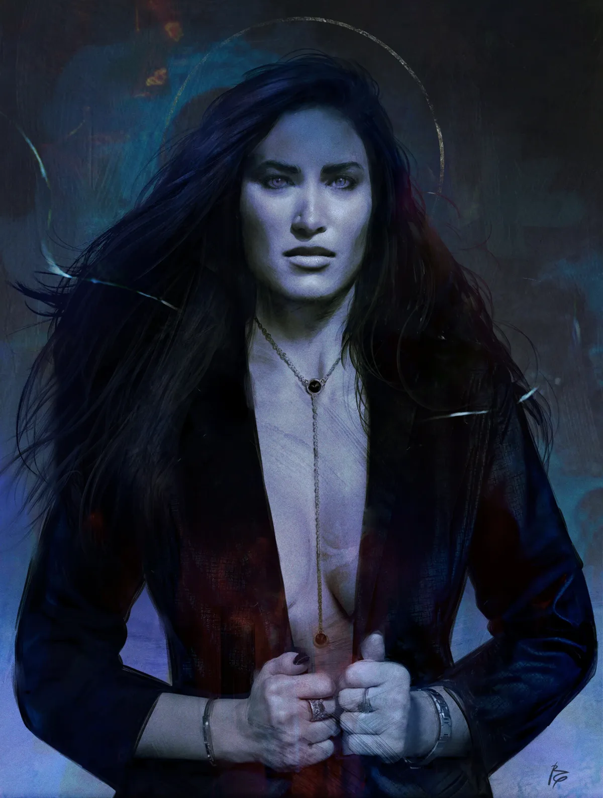

<dl>
<dt>Clan</dt><dd>Toreador</dd>
<dt>Generation</dt><dd>4th generation</dd>
<dt>Role</dt><dd>[Helena](/npcs/helena/)'s cover identity — neonate Toreador</dd>
<dt>City</dt><dd>Chicago</dd>
</dl>

