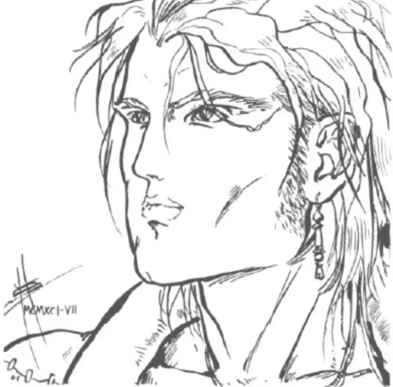

<dl>
<dt>Role</dt><dd>[Helena](/npcs/helena/)'s Guardian</dd>
<dt>City</dt><dd>Chicago</dd>
</dl>

Prias was born over three thousand years ago in Asia Minor — the western coast of modern Turkey, during the late Bronze Age or early Iron Age. The source material identifies him as "the most beautiful man in the region," which in that context meant a man whose physical perfection carried political and religious weight. Beauty in the ancient Aegean was not decorative. It was a mark of divine favor, a claim to authority, a reason to be fought over.

He met [Helena](/npcs/helena/) before she was anything other than mortal. They fell in love and fled together to Asia Minor — suggesting [Helena](/npcs/helena/)'s origins lay elsewhere, possibly in the Greek mainland or the islands. The flight implies they were running from something: an arranged marriage, a political obligation, a prior claim on [Helena](/npcs/helena/)'s person. What they ran from found them. Minos — an ancient Toreador whose name echoes the legendary king of Crete — pursued them, abducted [Helena](/npcs/helena/), and left Prias for dead.

Prias did not die. He spent thirteen years tracking [Helena](/npcs/helena/) across the ancient Mediterranean, a search that would have taken him through coastal trade routes, island chains, and port cities where information moved at the speed of sail. He found her in Argos, one of the oldest continuously inhabited cities in Greece, a Mycenaean stronghold already ancient when Prias arrived. But the woman he found was no longer the woman he had lost. Minos had Embraced her. She was Kindred.

What happened next established the pattern for the next three millennia. Prias attacked Minos with soldiers — mortal soldiers, armed and organized, thrown against a vampire. He speared Minos through the heart. [Helena](/npcs/helena/) leapt on the staked Methuselah and committed diablerie, consuming his soul and his power. Then she turned to Prias and offered the Embrace.

He refused. "I would never become one of the horrors who fed on the blood of the living." The sentence is recorded in the source material as direct quotation, which means someone — [Helena](/npcs/helena/), or Prias himself — considered it important enough to preserve across thirty centuries.

Instead, Prias drank [Helena](/npcs/helena/)'s blood. Not the Embrace, but the beginning of a ghoul arrangement that has persisted for over three thousand years. [Helena](/npcs/helena/) fed on Kindred and mortals. Prias fed from [Helena](/npcs/helena/). He gained vitae-enhanced strength, endurance, and longevity. He also gained the Blood Bond — three drinks from the same Kindred, and the Bond became total. For two thousand years, Prias served [Helena](/npcs/helena/) under a compulsion he did not fully understand, believing his devotion was love rather than chemistry.

[Helena](/npcs/helena/) used the Bond to turn him into a weapon. She hunted Kindred — [Menele](/npcs/menele/) above all, her eternal rival — and Prias was her instrument. Carthage, Rome, Constantinople, the centuries of Jyhad warfare across Europe and the Near East. Prias fought in battles that mortal historians never recorded, carrying a silver Carthaginian sword that creates wounds in vampires which do not heal. He reads as a vampire to Auspex. Some Kindred who have encountered him believe he is Inconnu. He is not. He is a mortal man who has been drinking the blood of a fourth-generation Toreador Methuselah for three thousand years.

The critical shift came in Chicago. The climactic battle between [Helena](/npcs/helena/) and [Menele](/npcs/menele/) near Fort Dearborn left both Methuselahs in torpor. Prias stopped feeding from Helena to ensure she had enough vitae to heal. As the Bond faded — Blood Bonds weaken without reinforcement — Prias experienced something he had not felt in two millennia: free will. The realization of what he had been, what she had made him, did not drive him away. He still loves Helena. He still does what she orders. But the obedience is now a choice, not a compulsion, and the difference matters to him even if it changes nothing visible to an outside observer.

He now feeds exclusively on Kindred he kills. His haven is beneath the [Succubus Club](/locations/succubus-club/), guarding the passage to Helena's vault. He is not a vampire. He is a three-thousand-year-old man who chose mortality and lost everything except the choice itself.
