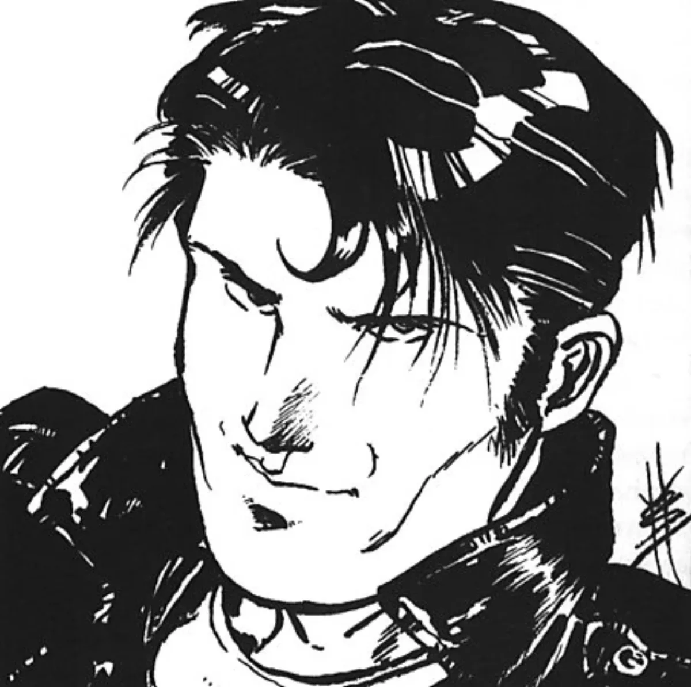

<dl>
<dt>Clan</dt><dd>Gangrel</dd>
<dt>Generation</dt><dd>8th generation</dd>
<dt>Role</dt><dd>Wolf Pack biker / former racing star</dd>
<dt>City</dt><dd>Chicago</dd>
</dl>

Randy Zelley was tearing up the racing circuit in the 1950s when an accident on his Harley left him torn up. The doctors gave him no chance of walking, let alone riding, ever again. Tyrus had been watching him for some time; unwilling to let this promising young biker lose the freedom of riding, Tyrus approached him in the hospital and offered him freedom from pain and suffering. The next night, Randy, taking the name Ramrod, was riding the streets once more.

**Image:** Dashingly handsome young man -- jet black hair, pale skin and piercing green eyes.

**Roleplaying Hints:** Brag, brag and then brag some more.

**Haven:** None.

**Secrets:** D
