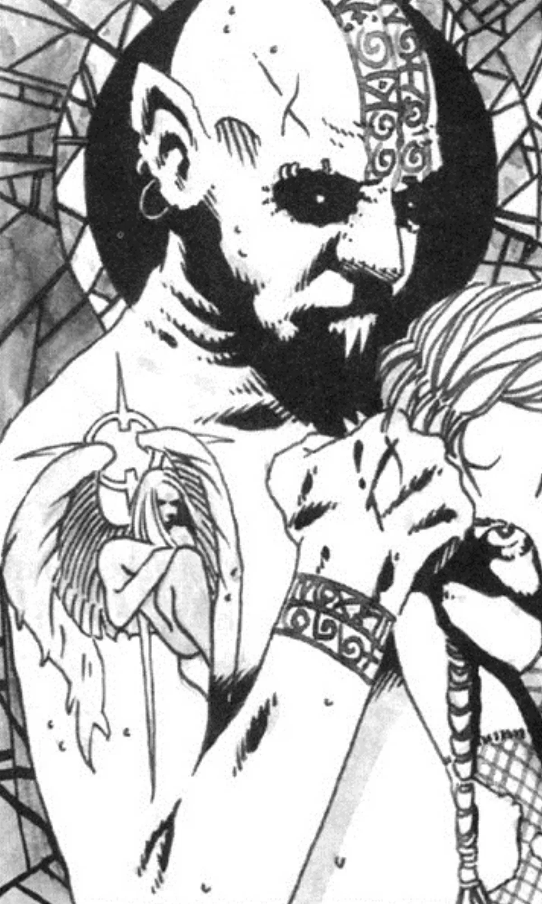

<dl>
<dt>Clan</dt><dd>Nosferatu antitribu</dd>
<dt>Generation</dt><dd>10th generation</dd>
<dt>Role</dt><dd>Guardian of the Hollow Saints, Shepherd</dd>
<dt>City</dt><dd>Montreal</dd>
</dl>

Raphael Catarari was the first result in a series of dark experiments conducted by Frere Marc. In 1875, following a long court battle, Catholic Bishop Bourget was forced to bury liberal intellectual Joseph Guibord in the Cote-des-Neiges cemetery on Mount Royal. Bourget declared Guibord's plot "morally separate" from the holy burial ground. Frere Marc knew that such a declaration might affect the aura of faith on the mountain, and decided to experiment with the Creation Rites in the plot. In 1892, he arranged for a nomadic pack known as the "Bastards" to bring him a freshly Embraced neonate.

The Nosferatu antitribu who emerged the next night called himself "Raphael" and had two odd characteristics: a palpable aura that occasionally became visible, and only vague memories of his life. He eventually came to believe himself a fallen angel. Claiming to have been cast out of Heaven for having slain another of the Host, Raphael dedicated his unlife to redeeming the childer of Caine in repentance. He became the guardian of the Hollow Saints as part of this quest and altered Yitzhak's rite of Sainting based on his own inspirations.

Raphael's mind is fragile. When he's lucid, he displays ancient wisdom and enlightenment. He took the traumatized Cherubim into his care and created the Obertus Choir of Caine. When Raphael's mind becomes unhinged -- during the extremes of the Divine Tide -- he is dangerously obsessive. In 1990, he reached the heights of grace and began a campaign of public preaching, during which he revealed his full angelic glory (through a potent application of Presence) to mortals in Montreal. He drove 50 people insane before Sangris and Cherubim could put a stop to his evangelizing. He is currently entering the darkest phase of his Tide and has become erotically obsessed with his companion Cherubim.

**Image:** Raphael's twisted Nosferatu form hints at how beautiful he must have been as a mortal. Only his deep-green eyes remain to testify to a heavenly form. Occasionally, a golden aura shimmers around him.

**Secrets:** Raphael is the only Shepherd who suspects Yitzhak of treachery, having found his rite of Sainting to be lacking in many ways. Raphael seeks to redeem the coven priest.
