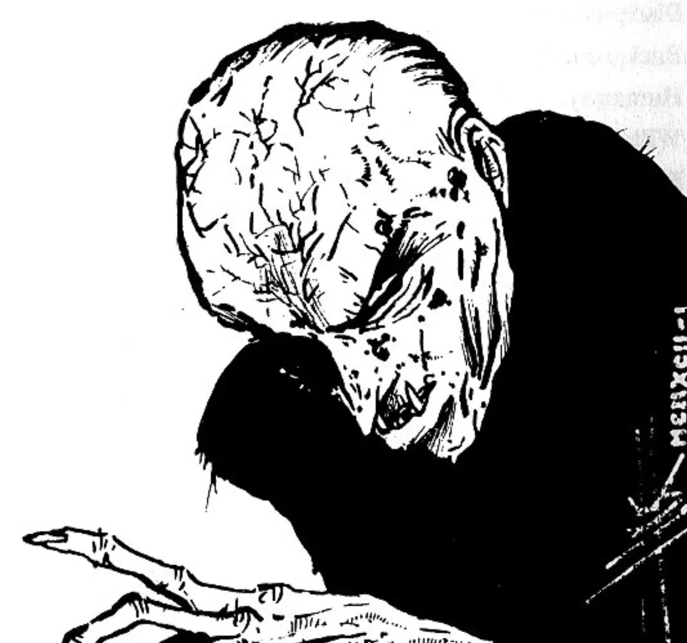

<dl>
<dt>Clan</dt><dd>Nosferatu</dd>
<dt>Generation</dt><dd>8th generation</dd>
<dt>Role</dt><dd>[Parovich](/npcs/parovich/)'s blood-bound childe</dd>
<dt>City</dt><dd>Milwaukee</dd>
</dl>

Embraced in 1990. Raul ran an illegal imported-car dealership and was snorting cocaine at home when [Parovich](/npcs/parovich/) showed up and Embraced him over three nights of forced blood drinking. Raul gave [Parovich](/npcs/parovich/) all his money and moved into the old mansion. He worships [Parovich](/npcs/parovich/) as a father figure.

[Kristian](/npcs/kristian/) once warned Raul that [Parovich](/npcs/parovich/) was dangerous, but Raul threatened to tell [Parovich](/npcs/parovich/). When he did, [Parovich](/npcs/parovich/) knocked him through a wall. Raul is blood-bound — Parovich makes him drink his blood very often. Lately, vile people have been showing up at the house, and Raul has not seen the other childer in six months. He is beginning to wonder if [Kristian](/npcs/kristian/) was right.

Short, dark-haired, weaselly man. Whines, connives, makes deals, never did anything honest. Now the same, but with warts all over his face and no hair.

**Apparent Age:** 26
**Embrace:** 1990
