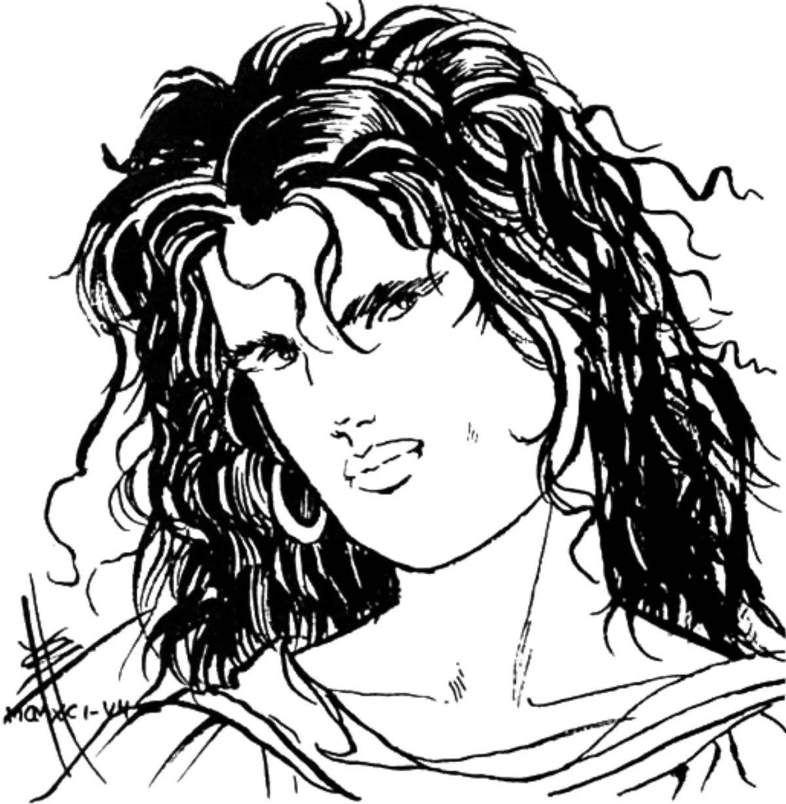

<dl>
<dt>Clan</dt><dd>Inconnu</dd>
<dt>Generation</dt><dd>5th generation</dd>
<dt>Role</dt><dd>Inconnu Monitor / Golconda guide</dd>
<dt>City</dt><dd>Chicago</dd>
</dl>

She was born in 9 BC in a village south of Jerusalem, during the reign of Augustus. Roman occupation was not an abstraction to her family. It was soldiers on the road, taxes extracted at spearpoint, the slow administrative murder of a people who had governed themselves for centuries. She became a sicarius — a dagger assassin working for the Zealots, the faction that believed Rome would only leave Judea when Romans started dying. She was one of the few women in their ranks. She killed a Roman merchant in a public assassination daring enough to force her flight from Jerusalem into the countryside.

In the Judean wilderness she met Elihu, a Ventrue who had turned his predation into a philosophy. Elihu hated the rich. He fed exclusively on the Jewish upper classes — the collaborators, the Sadducees, the men who profited from Roman occupation while their people starved. Rebekah became his retainer. She understood his war because it was a version of her own.

The Embrace came in violence. Roman legionaries caught them. Elihu took a wooden pilum through the chest — not the heart, but close enough. The soldiers set his body on fire. Rebekah drove them off, but Elihu was burnt beyond recognition, desperate for blood. She offered her own. He could not stop drinking. When he realized what he had done, he gave her enough vitae to bring her back. A.D. 12. She was approximately twenty-one years old.

For fourteen hundred years they traveled together. Africa, Europe, Asia. They fed on the powerful and the corrupt. They fell deeper in love with each passing century. They were, by any measure, happy — two predators who had found in each other a reason to endure the long nights.

Barcelona. The Inquisition. The city was burning Jews and Muslims and anyone else the Church decided was insufficiently Christian. Rebekah and Elihu fought alongside the persecuted, as they always had. Then a Camarilla Methuselah found them and delivered an ultimatum: stop fighting, join the Camarilla, accept the Masquerade. Rebekah refused. Elihu wanted to accept. It was their first disagreement in over a millennium. It was their last.

What happened next defines her. Rebekah gathered allies and attacked Elihu before he could leave Spain. She committed diablerie on her own sire and lover — drank his soul, consumed his essence, destroyed the person she had loved for fourteen centuries. Her allies died in the fight. She fled alone, carrying his blood and his memories inside her.

Centuries of penance followed. She wandered the Middle East as an ascetic, feeding as little as possible, visiting every holy site she could reach. She climbed Mount Ararat and found the remains of what tradition calls Noah's Ark. She sat there and did not move until she had mastered the Beast. An Ancient — one of the old ones, name unrecorded — guided her through the Suspire, the ritual of transcendence. She achieved Golconda. The Beast went silent. The hunger remained but it no longer commanded.

She joined the Inconnu and became a Monitor. The role suited what she had become: a watcher, not a participant. She was sent to the American colonies and eventually drawn to Chicago by the conflict between [Maxwell](/npcs/maxwell/) and [Lodin](/npcs/lodin/). She stayed. She found [Maldavis](/npcs/maldavis/) — a Caitiff reformer with Humanity 10 and no patron — and recognized in her something worth protecting.

Rebekah could not maintain her detachment. She threw herself into Maldavis's doomed rebellion against Lodin, barely preserving her anonymity. Now she guides Maldavis toward Golconda through dreams, the same path she walked centuries ago on a mountain in eastern Turkey. Her haven is the Shedd Aquarium — water on all sides, the sound of currents, a place that recalls nothing of Jerusalem or Barcelona or the man she consumed to survive.

Generation 5th, through diablerie. Humanity 10. Willpower 10. Courage 8. The only Kindred in Chicago who has mastered the Beast, and the proof that the cost of mastery is everything you love.
