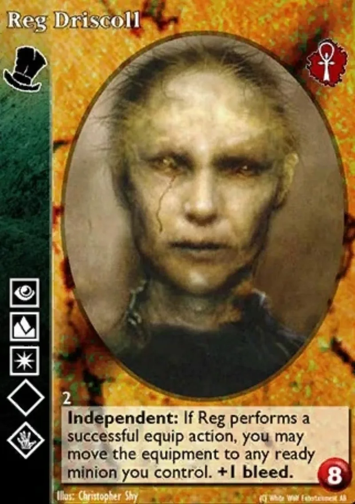

<dl>
<dt>Clan</dt><dd>Samedi</dd>
<dt>Role</dt><dd>Prison Smuggling Lord</dd>
<dt>City</dt><dd>Kingston</dd>
</dl>

Born in England, date unknown. Career British Army — enlisted rank, not officer class. Fought in the War of 1812 on the Canadian side. Died or was Embraced sometime during or shortly after the war. His sire called himself [Baron](/npcs/baron-vulture/) Samedi, which may have been a title, a name, or a joke. Driscoll never found out which and stopped caring decades ago.

Chose Kingston Penitentiary when it opened in 1835 because prisons are perfect for Samedi. The dead and the dying pass through constantly. Nobody examines the janitor. The underground spaces are extensive and unwatched. He has been there ever since, through name changes, administrative reforms, riots, and two centuries of Canadian corrections policy.

His wealth comes from the smuggling operation, compounded over 180 years. He does not display it. The janitor's closet contains a mop, a bucket, and keys to every door in the building. The offshore accounts contain enough to buy the building.
