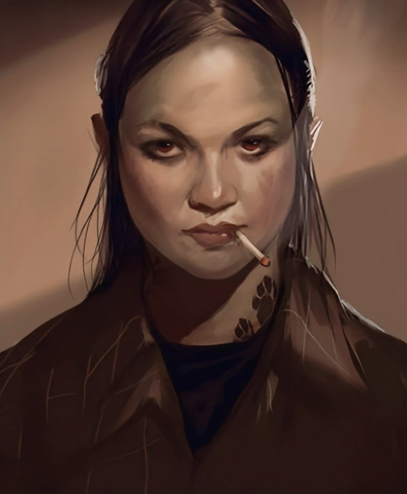

<dl>
<dt>Clan</dt><dd>Gangrel</dd>
<dt>Generation</dt><dd>8th generation</dd>
<dt>Role</dt><dd>Animal rights activist Gangrel</dd>
<dt>City</dt><dd>Chicago</dd>
</dl>

An animal rights activist at the University of Chicago in the early 1970s. Rosa's passion was the ethical treatment of animals, not the peace movement. She came to Doyle Fincher's attention after setting loose a herd of bulls destined for slaughter and running with them through the streets. While Fincher petitioned [Lodin](/npcs/lodin/) for permission to Embrace her, Rosa escalated to raiding corporate laboratories. One night, drunk after a party, she broke into Lincoln Park Zoo and freed several animals, including lions. Fincher approached her in wolf form and offered her the chance to "become one with animals." She thought he meant literal transformation. She accepted.

Disgusted by her first hunt with Fincher, Rosa has never spoken to him since. She swore to stop his predatory ways and to use her abilities for the benefit of animals. Both promises have faded with time. She will not feed on animals and only feeds on humans -- generally science students and their professors.

**Image:** An attractive young Hispanic woman with dark hair and a slim figure. Generally dresses in jeans, T-shirts and sandals.

**Roleplaying Hints:** Relaxed unless the subject of hurting animals comes up. Then she speaks almost in frenzy.

**Haven:** House near the University of Chicago.

**Secrets:** C
