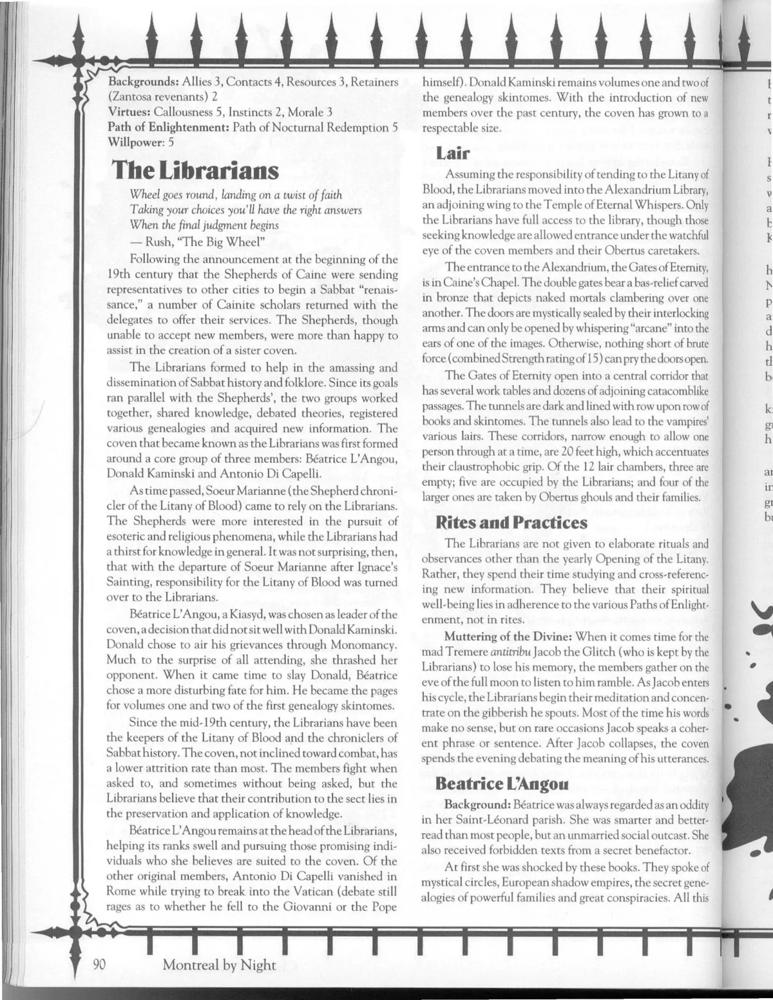

<dl>
<dt>Clan</dt><dd>Toreador antitribu</dd>
<dt>Generation</dt><dd>9th generation</dd>
<dt>Role</dt><dd>Shepherd, artist of corruption</dd>
<dt>City</dt><dd>Montreal</dd>
</dl>

Sabrina was an art student who flirted with several fringe religions and thus attracted Yitzhak's attention. While mortal, she studied religious artwork. Now that she's a vampire she studies life and unlife. Depending on her Divine Tide, she restores the most horrendous of creatures or mars the perfect.

Sabrina's greatest accomplishment is the corruption of Montreal-born super-model Claire. The Toreador convinced her that beauty was only valuable if it lived with horror, and she watched as the mortal "highlighted her appeal" by creating an aura of tragedy about herself. Under Sabrina's influence, Claire arranged for gruesome "accidents" to claim her family and manipulated a stalker into killing her fellow models. Claire's picture, radiant in the splattered blood of her colleagues, flashed across every television in North America. Sabrina used that image to show Claire how violence accentuated her beauty. In 1992, Claire shocked the world when she used a razor to peel off her own face during a Nightly Entertainment interview.

Sabrina's most recent project is the monstrous Nosferatu, [Elias the Whale](/npcs/elias-the-whale/). She has uncovered the beauty at the core of [Elias](/npcs/elias-the-whale/)' being and is nurturing it through romance. The two vampires meet regularly. Love blossoms in [Elias](/npcs/elias-the-whale/)' heart, and the Toreador looks forward to it blooming so that she can shatter it, making [Elias](/npcs/elias-the-whale/) the perfect creature of horror.

**Image:** A stunning beauty, Sabrina has long auburn hair. However, her hair can't hide the scars that remain from her mortal experiments with body art. She stains all of her clothes with blood to contrast her beauty with horror.

**Secrets:** Sabrina has discovered a hidden cache of [Veronique](/npcs/veronique/) La Cruelle's "homicidal artwork," as well as two of the archbishop's Zantosa servants. They have since become Sabrina's retainers.
