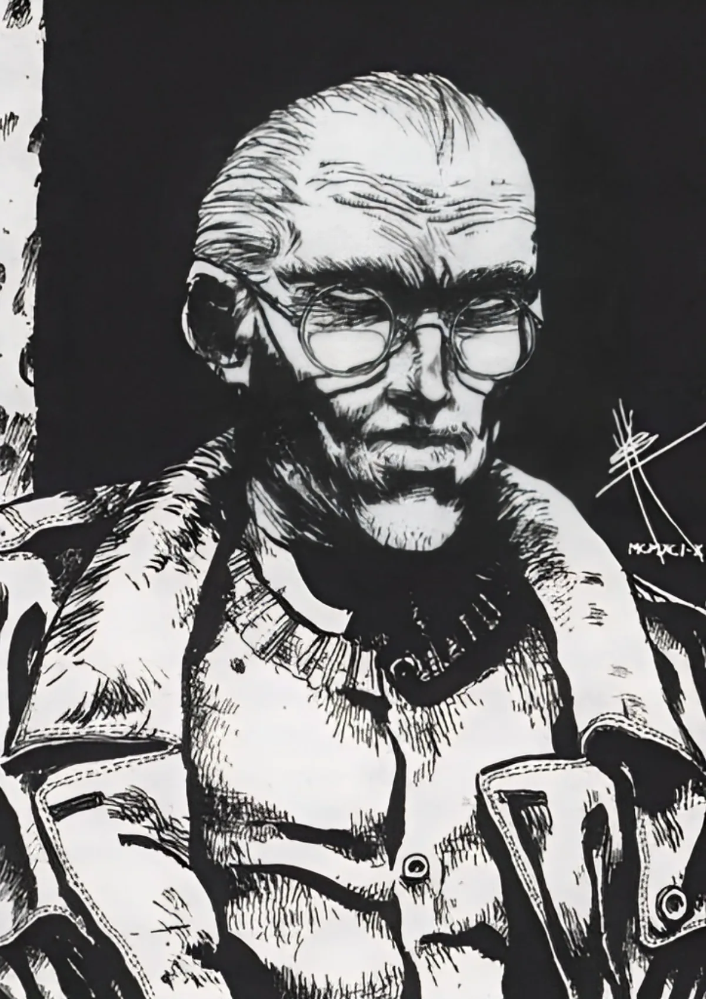

<dl>
<dt>Clan</dt><dd>Mortal</dd>
<dt>Role</dt><dd>Hunter-scientist with a biological weapon</dd>
<dt>City</dt><dd>Chicago</dd>
</dl>

Born in Warsaw, 1932. Survived the camps. Emigrated to the United States in 1947. Earned advanced degrees in microbiology. Spent his academic career at midwestern universities, publishing unremarkable papers while conducting private research on blood-borne pathogens that attacked a very specific biological profile.

He watched vampires feed in the camps. He was seven years old. The guards did not notice the boy in the corner, and the things that fed on the prisoners did not care. He remembered. He studied. He built.

Isaac was his only child. Isaac went to the [Succubus Club](/locations/succubus-club/) because he was young and Chicago was exciting and he did not believe his father's stories about monsters. Isaac was wrong.
