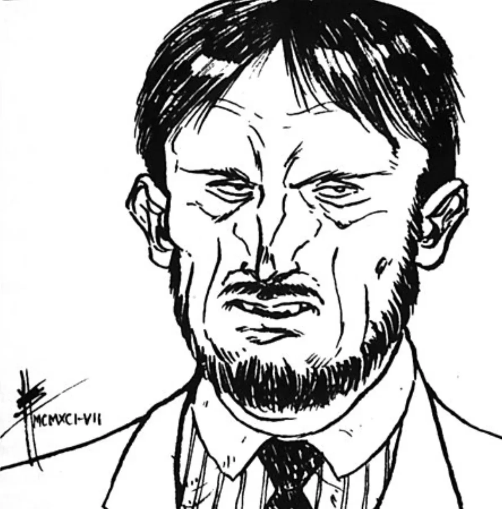

<dl>
<dt>Clan</dt><dd>Ventrue</dd>
<dt>Generation</dt><dd>8th generation</dd>
<dt>Role</dt><dd>[Lodin](/npcs/lodin/)'s failed economic advisor / wife-killer</dd>
<dt>City</dt><dd>Chicago</dd>
</dl>

Jacob Schumpeter had everything he could want: a seat on the Chicago Board of Trade, a subservient wife to beat and cheat on, two daughters to ignore or abuse, and a nice home in the suburbs to avoid. He could not understand why he was unhappy. The more this question bothered him the more unhappy he became, and the more often he took out his frustration on his family. Soon his wife had left and filed for divorce, taking the children with her. The daughters' teachers and social workers were just beginning to become interested in the bruises the girls were sporting when Lodin contacted him.

In putting together his second brood, the Prince needed someone other than [Ballard](/npcs/ballard/) to help him control the city's economy. Schumpeter had made his way in commodities trading and Lodin decided this man would do admirably. He told Schumpeter of the life which was open to him and Schumpeter jumped at the chance. That night, after the Change, he made his way to the house where his wife was staying. He attacked her as she was preparing for bed, taunted her as he held her high over his head, then dashed her head against the wall and began to lap at her blood.

Flushed with the thrill of his new power, he did not notice when his two daughters entered the room. The younger one brought a baseball bat down on his head. Schumpeter recovered quickly thanks to the blood he had just drunk, and in a frenzy attacked his two children. Together the two girls managed to escape out the door and into a passing taxi.

While Lodin was upset at this breach of the Lex Talionis, he pardoned his childe in the hope of using Schumpeter's economic knowledge. Unfortunately, his rise to power in the mortal world came via favors from his powerful father and father-in-law, not by any ability of his own. Lodin was much chagrined when he discovered Schumpeter was no match for Ballard and his lieutenants. Indeed, Ballard delights in asking Schumpeter for advice and then showing the numerous flaws in the younger Vampire's suggestions.

Of late, Schumpeter has found his life among the Kindred to be even more frustrating than his life as a mortal. He has taken to relieving his frustrations by beating women, and feeds only on abused, beaten females. He has managed to capture his older daughter and add her to his herd, but has not been able to find his younger one. The younger daughter, after meeting [Detective](/npcs/detective-wilks/) [Gregory Stephens](/npcs/gregory-stephens/) (who investigated Schumpeter's wife's murder), became a Vampire hunter and now has several kills to her credit. She is starting with the small fry until she gets the hang of it, and then she's going after her father.
