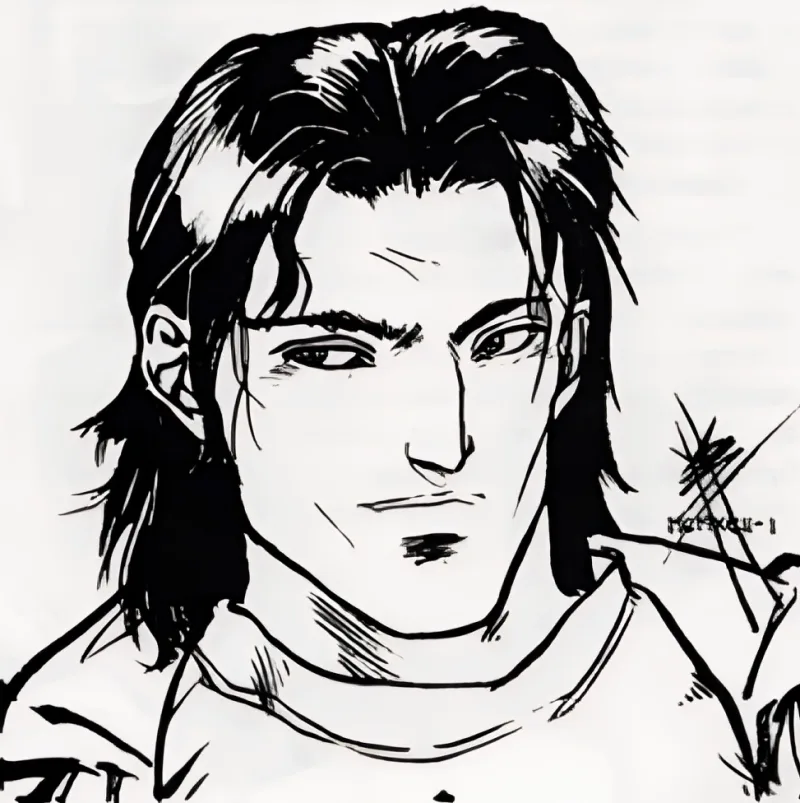

<dl>
<dt>Clan</dt><dd>Brujah</dd>
<dt>Generation</dt><dd>7th generation</dd>
<dt>Role</dt><dd>The Black Prince</dd>
<dt>City</dt><dd>Milwaukee</dd>
</dl>

[Edward](/npcs/edward-williams/) Scott was born in 1399 in Cornwall, the southwestern peninsula of England -- a place that had always stood slightly apart from the rest of the kingdom. Cornish tin mining was in decline, the Duchy's revenues shrinking, and the local gentry occupied a precarious middle ground between the English crown's demands and a population that still spoke its own language and nursed its own grievances. The Cornish would rebel three times in the next century. Scott grew up in that atmosphere of stubborn resistance.

He earned the nickname "the Black Prince of Cornwall" not for any racial identity but for his temperament. He fought everyone: his father, the local lord, the church, other squires. The original Black Prince -- [Edward](/npcs/edward-williams/) of Woodstock, Prince of Wales, dead since 1376 -- was remembered in Cornwall as a figure of martial ferocity. Scott's neighbors hung the name on him with more mockery than respect. He married young, fathered a son, and managed a small estate with the combative energy of a man who considered peace a personal insult.

Sir Lorence came to Cornwall in 1432. The Wars of the Roses were still two decades away, but the factional tensions that would produce them were already grinding through the English nobility. Lorence was a knight of some reputation -- the source calls him "famous" without specifying which campaigns or which lord he served. What mattered was that Scott trusted him. Lorence presented himself as a fellow soldier, earned entry to Scott's household, and one night killed Scott's wife and son and Embraced him. The betrayal was total. Everything Scott valued -- family, loyalty, the code of arms -- was destroyed by the very code that was supposed to protect it. A knight violated a knight's trust, and the cost was everything.

That wound never healed. It became Scott's operating principle. For five and a half centuries he has positioned himself as the protector of the young against the predation of the old, because he knows exactly what elder predation looks like: it looks like a friend entering your home and murdering your family. "I can't let any more Elders slay the young just because they are weaker." The statement is sincere. It is also a scar talking.

Scott arrived in Milwaukee sometime in the twentieth century and claimed Brujah Primogen status through sheer force of personality. Presence 6 is not subtle -- he fills rooms, commands attention, and makes people want to follow him before they have decided whether he deserves it. He sits on the Primogen Council as the voice of the Anarchs, wearing bathrobes and leather jackets and once a bikini to meetings, because the theater of disrespect is his weapon against elders who take themselves seriously. He challenges Primogen to personal duels to defend Anarch rights. No one has ever accepted. This is partly because they fear his combat ability, and partly because accepting would dignify the challenge.

The source material notes: "He is not half as tough as he thinks he is." Scott's courage is real, his Presence enormous, his convictions genuine. But his understanding of his own limits is catastrophically poor. He makes passes at every woman he meets, theatrical declarations of principle in every Council session, and enemies in every corridor. "One day they'll kill me for it," he says, "but until then I live like a Prince." The Anarchs call him "the Black Prince" to annoy the Elders, conflating the Primogen title with the monarchical one. Scott loves it. He does not see the irony: a man who hates elder authority performing the role of a prince.

Somewhere in his past is a childe he does not remember Embracing. That childe is [Akawa](/npcs/akawa/).
