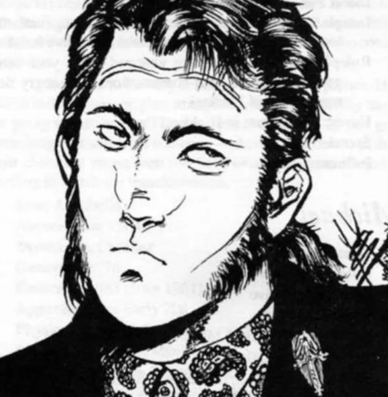

<dl>
<dt>Clan</dt><dd>Toreador</dd>
<dt>Generation</dt><dd>10th generation</dd>
<dt>Role</dt><dd>South Side Assessor</dd>
<dt>City</dt><dd>Chicago</dd>
</dl>

English naval captain, born 1825, Embraced 1858. Sondra Dominated him into loading her coffin onto a ship bound for America. When a frontier attack threatened her existence, she drained him and Embraced him out of desperation — survival, not affection. She taught him the Traditions, taught him the Masquerade, and then they parted ways permanently. No ongoing sire-childe relationship.

In recent years he has given in completely to his Bon Vivant nature. The discipline and precision of the naval officer are gone. What remains is appetite and social instinct. He over-indulges in blood, in company, in spectacle. [Ballard](/npcs/ballard/) knows Sir Henry has crossed lines — the sloppy feeding, the excesses. Whether [Ballard](/npcs/ballard/) acts on that knowledge depends on politics, not conscience.

Apparent age early thirties. Large frame. Dark-complexioned. An air of dignity undercut by the permanent flush of too much blood. Only rarely is he not visibly overfed.
