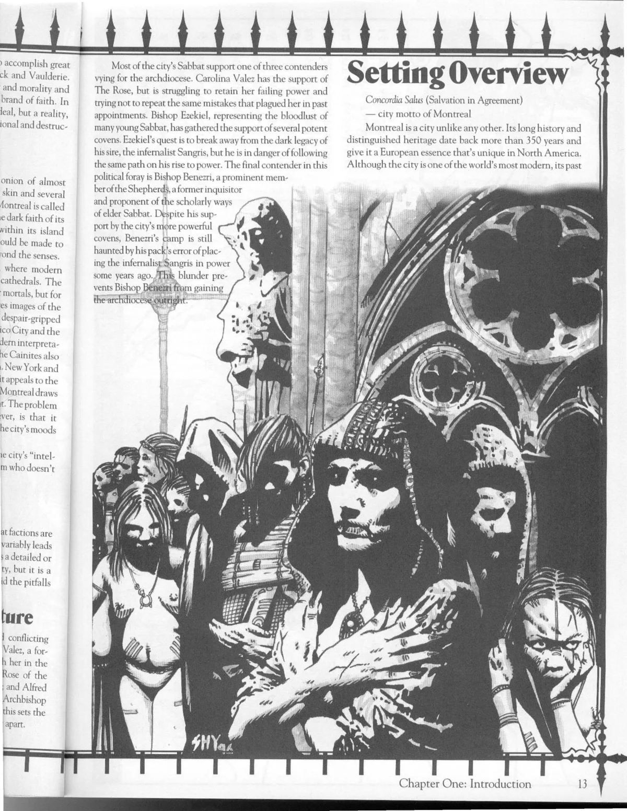

<dl>
<dt>Clan</dt><dd>Malkavian antitribu</dd>
<dt>Generation</dt><dd>11th generation</dd>
<dt>Role</dt><dd>Nominal leader of Les Miserables</dd>
<dt>City</dt><dd>Montreal</dd>
</dl>

Born Alexandre Prouville, Skin's sole mortal dementia was a hypochondriacal delusion. He believed that his genuine skin disorder was caused by insects living under his flesh, and his attempts to root them out left him horribly disfigured. His parents, unable to deal with his problem, handed Alexandre over to Douglas Hospital. His treatment, however, didn't come from doctors, but from the brutal administrations of Les Miserables. They used Dementation to foster his delusions and gave him X-acto knives, ice picks and screwdrivers to help dig out those annoying pests. Preacher spent many a night howling in unison with Alexandre.

When Preacher finally decided to Embrace his protege, he wrapped himself up in his student's delusions, augmented them, and then reveled in the bloodbath as he and his paramour took to excising the insects. By the end of the orgy, when Alexandre was close to death and he had all but sheared away his own face, Preacher took him.

As a member of the Sabbat, Skin still believes that insects live under his skin. He constantly picks and prods at his gaping wounds -- a major reason why others can't stand being around him. Skin is the nominal leader of Les Miserables, but maintains that his status is temporary until Preacher returns. His best friend is his stepsister Molly 8.

**Image:** Skin is a walking mass of ragged flesh, exposed muscle and open wounds. He can overwhelm the staunchest of constitutions.

**Secrets:** Skin has a painting by the Shepherd and inquisitor Zhou, which he has "borrowed" and modified. The piece, one of Zhou's secret Taoist maps that leads to one of his ledgers, is a painting of the interior of Place de la Cathedrale mall.
