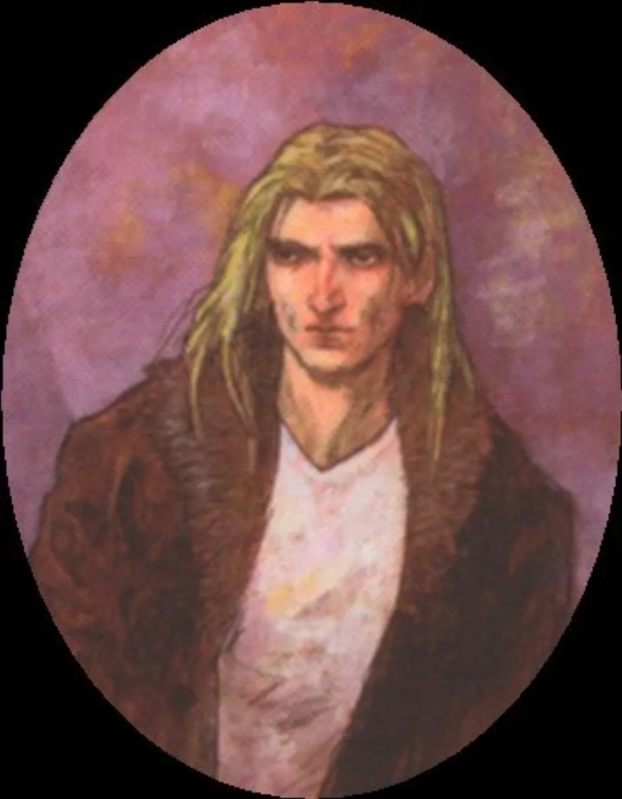

<dl>
<dt>Clan</dt><dd>City Gangrel antitribu</dd>
<dt>Generation</dt><dd>7th generation</dd>
<dt>Role</dt><dd>Ezekiel's mentor, 25:17 member</dd>
<dt>City</dt><dd>Montreal</dd>
</dl>

Benjamin Harris returned from World War I like so many of the Lost Generation: empty, bitter and above all else, disillusioned. Even years later, during the Roaring '20s, Benjamin couldn't silence the voices of his dead comrades. A loving family man, Benjamin tried to keep his dark side in check. He finally caved in exactly 10 years after his return. That night he killed his family, hanging his son and daughter and burning his wife alive. Benjamin vanished into the night with the police and the Sabbat (who were impressed by his deeds) hot on his tail. A Sabbat Gangrel named "Nacy Tarr" got to him first.

Benjamin's anger and aggression were sublimated by the rituals and purpose of the sect. Calling himself "Soldat," he joined the Black Hand and dutifully served the Sabbat, but refused to live up to his leadership potential, preferring to be a follower. Soldat was one of Ezekiel's mentors, and the two developed a close friendship. Soldat believes that Ezekiel has the potential to better the Sabbat. In turn, the young Serpent appreciates the Gangrel's keen intellect, which lies beneath his tough exterior.

**Image:** Soldat is an impressive figure, standing over six feet tall. His face is strong and firm, framed by shoulder-length blond hair. Soldat is known for wearing WWI-era pants and a brown leather trench coat. He sometimes carries a set of bagpipes and plays them during war parties and pack rites.

**Secrets:** Soldat occasionally meets with Archbishop Valez in hopes that she and Ezekiel can come to an understanding without resorting to war.
