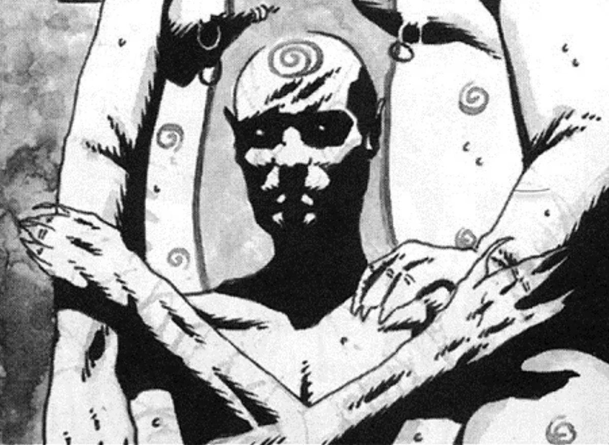

<dl>
<dt>Clan</dt><dd>City Gangrel antitribu</dd>
<dt>Generation</dt><dd>9th generation</dd>
<dt>Role</dt><dd>The Wretched member, predator</dd>
<dt>City</dt><dd>Montreal</dd>
</dl>

Born Jimmy Smythe, Spider emigrated from Jamaica as a small boy. As he grew older, he realized he was attracted to men but could not accept his "deviant feelings," and instead he became a bully and womanizer. Eventually, he crept into the Gay Village and picked up street hustlers to satisfy his physical needs. It was this behavior that attracted Sebastien Goulet, who had always taken great pleasure in "outing" people like Jimmy. Within a year, Jimmy was coming to the Village every week to have sex with Sebastien. The Gangrel finally thought his protege was ready for the Embrace in 1984 and took him during an orgy of sex and blood.

Sebastien didn't know that Jimmy tortured himself with self-hatred every time he went home from the Village. Sebastien revolted Jimmy, and the childe experienced his most potent frenzy when confronted with his sire. Sebastien barely survived the attack. Jimmy embraced his frenzy -- his animal aspect -- as protection against his desires. He replaced the longing for male arms with the need to hunt and kill, and he called himself "Spider." His rejection of humanity attracted the attention of Stephanie and Elias, who brought him into their fold.

Spider's desires come to the surface when he is alone. He stalks attractive men, attempts to seduce them, and then forces himself on them. He feeds from these vessels (and has even gone as far as Embracing a few) and then destroys them in fits of savage shame and self-hatred.

**Image:** The Crucible has made Spider long and inhumanly flexible and has darkened his chocolate skin to a shiny hairless black and has made his eyes a similar color. His Wolf's Claws now manifest as sharp hooks at the ends of his fingers and toes, which allow him to climb and perch like a real spider. Spider carries a weighted barbwire lash that he uses to snare his prey.
