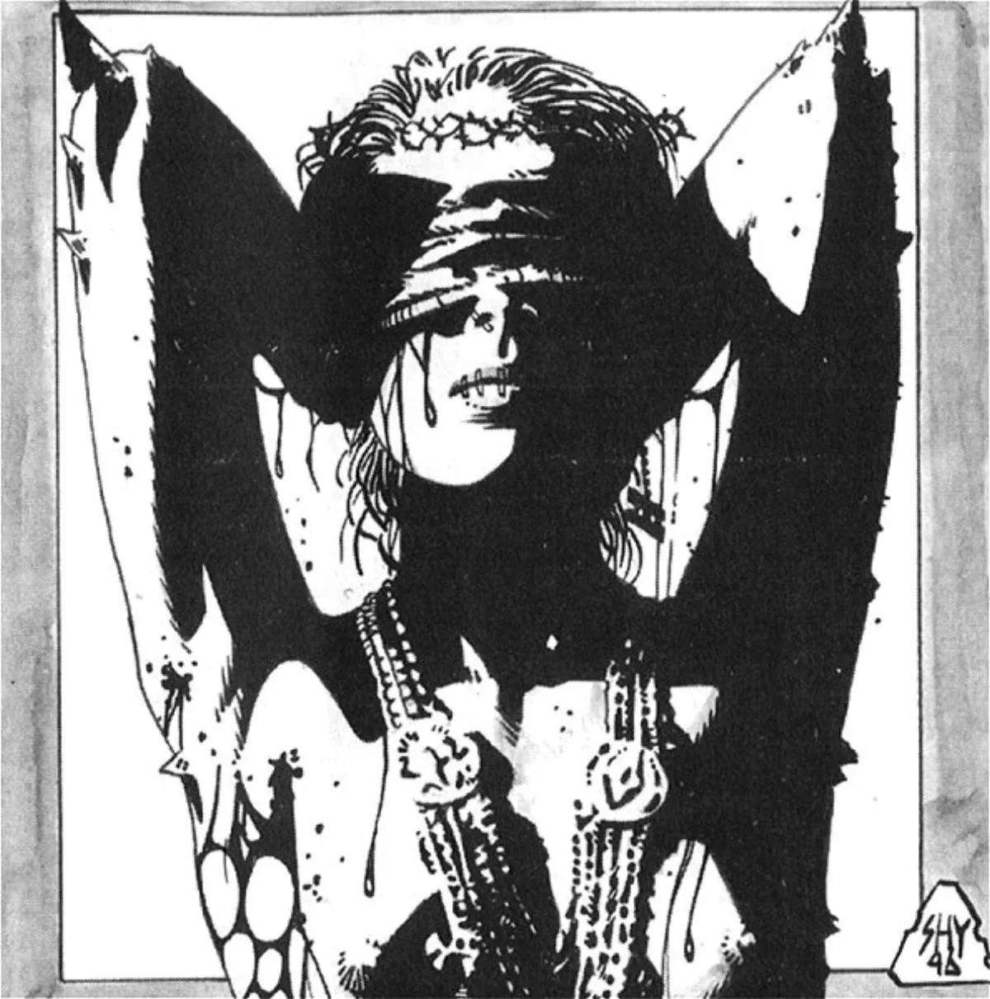

<dl>
<dt>Clan</dt><dd>Tzimisce</dd>
<dt>Generation</dt><dd>7th (lowered from 8th through diablerie) generation</dd>
<dt>Role</dt><dd>Pack Priest, the Wretched</dd>
<dt>City</dt><dd>Montreal</dd>
</dl>

Stephanie first came to the attention of her sire, [Maciej Zarnovich](/npcs/zarnovich/), when she was hospitalized for extensive third-degree burns suffered when she set her family home ablaze. The inhuman pleasure she took in the fire intrigued [Zarnovich](/npcs/zarnovich/). Not only did the flames fascinate her, but she remembered being burned as a moment of ecstasy. The Tzimisce circus-owner Embraced her upon her release from intensive care.

Entranced by the possibilities of Vicissitude, Stephanie molded her body and dreamed of melding with the flames she loved. She first served as a contortionist and later as a fire-eater in her sire's freak show. She even wove steel bands into her flesh to toughen it against the flames she adored. Stephanie also started down the Path of Power and the Inner Voice. Learning to pursue her own goals above all else, she felt compelled to leave the circus because Zarnovich put the transformation of mortals above vampiric evolution. However, she has never broken her bond with her sire.

The Wretched was born from the drive of Stephanie L'Heureux to push the envelope of vampiric evolution. In 1980, she left her sire Zarnovich's side to pursue her goals, recruiting the bloated Nosferatu antitribu [Elias the Whale](/npcs/elias-the-whale/). Both vampires realized that they were changing into things beyond simple Embraced humans. They also understood that the concerns of other vampires were mostly the vestiges of their mortal lives. The two christened their pack the "Wretched" and dedicated themselves to pursuing their personal quests to discover the true nature of the vampire.

Stephanie has created a truly unique Thaumaturgical ritual called the Crucible that requires her to prepare a cup of her own refined vitae. Those who drink the mixture temporarily gain subconscious use of Vicissitude and find their bodies transforming to match their self-images.

**Image:** Stephanie looks utterly inhuman. She has inserted metallic strips into her skin, which appear as shining protrusions at her joints. Her face has become almost featureless; her mouth and eyes are mere slits.

**Secrets:** Stephanie recognizes [Ezekiel](/npcs/ezekiel/)'s limitless ambition and instinctively knows that he is ready to destroy Montreal to satisfy his desires.
