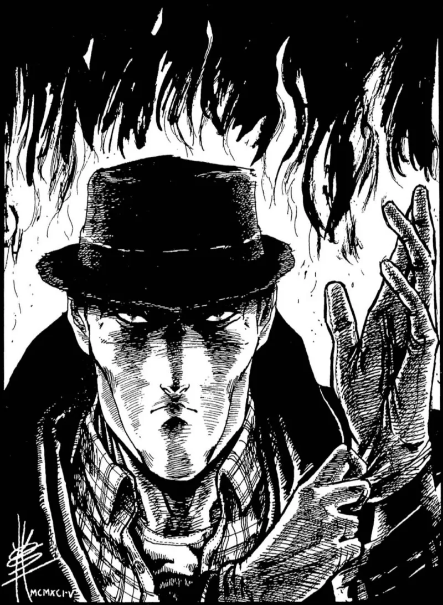

<dl>
<dt>Clan</dt><dd>Mortal</dd>
<dt>Role</dt><dd>Witch-Hunter</dd>
<dt>City</dt><dd>Gary</dd>
</dl>

Born in England, 1957. Entered the Jesuits in 1980. First Kindred kill in 1982, Washington, D.C. Formerly Church-affiliated through the Society of Leopold. Now independent — which means no handler, no extraction team, and no one to tell him when to stop.

Was in Gary during the early-to-mid 1990s. Hunted Gary once before, when the feud between Modius and Lodin was still active. He stayed long enough to make unlife very difficult for the local Kindred, then moved on. He is back.

Wanted by the FBI under multiple aliases. Also wanted by police departments of Boston, New York, Detroit, Chicago, Los Angeles, and Las Vegas. Six cities. Every warrant involves unexplained deaths that looked like house fires or industrial accidents until someone examined the bodies.

Severe burn scars on both hands and forearms. Wears gloves always. Long coat with wooden stakes stitched into the lining. The coat looks clerical until you notice the weight distribution.

Will eventually whisper about Golconda if he judges the vampires have maintained their Humanity. The hunter who believes monsters can be saved is more dangerous than the one who does not — because he will get close enough to find out.
