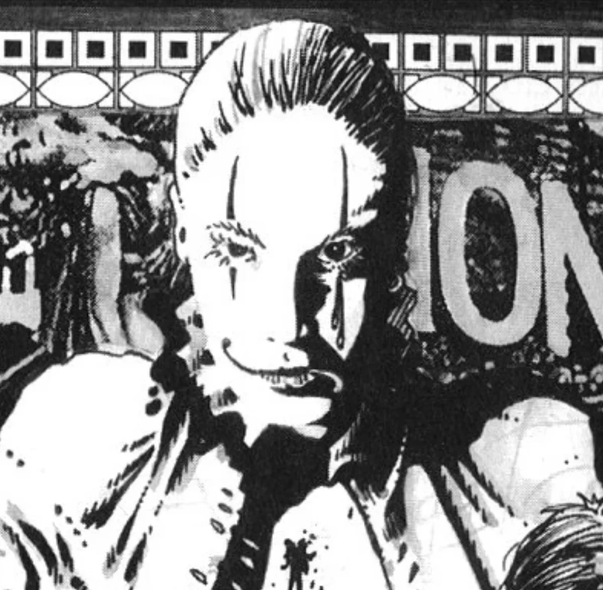

<dl>
<dt>Clan</dt><dd>Toreador antitribu</dd>
<dt>Generation</dt><dd>10th generation</dd>
<dt>Role</dt><dd>Circus clown, emotion artist</dd>
<dt>City</dt><dd>Montreal</dd>
</dl>

Tears is one of the few to have survived the Widows' passions. He was a male prostitute who specialized in B&D and was approached by [The Rose](/npcs/the-rose/) and [Creamy Jade](/npcs/creamy-jade/) for a night of passion and games. Instead of being the master, [Creamy Jade](/npcs/creamy-jade/) turned him into the slave and subjected him to the most degrading and vile of acts. As the evening progressed, Tears' mind came close to shattering and Creamy Jade hadn't even used Dementation on him. As Tears stood on the brink of death, Creamy Jade decided to Embrace him because she had never taken a childe before. His Creation Rite was both painful and pleasurable, and Tears enjoyed the Widows' love for the following weeks.

Sensing that the Cathari might tire of him, Tears joined the circus, hoping that distance would endear him to the Widows. Tears is a clown par excellence, an artist whose medium is human emotion. He has had his face permanently altered by [Zarnovich](/npcs/zarnovich/) into that of a dark pierrot. Tears' show takes his audience on a journey of incredible intensity; using Dementation and Presence, he instills every possible human emotion until the crowd either goes insane or becomes catatonic.

**Image:** Tears is the ultimate pierrot. His chalk-white face is dotted with two red tears that fall from his left eye. His black-colored lips are permanently set through Vicissitude, with one side in a leering smile and the other in a frown. Tears wears a black satin suit and white bloodstained ruffles around his neck and hands.
