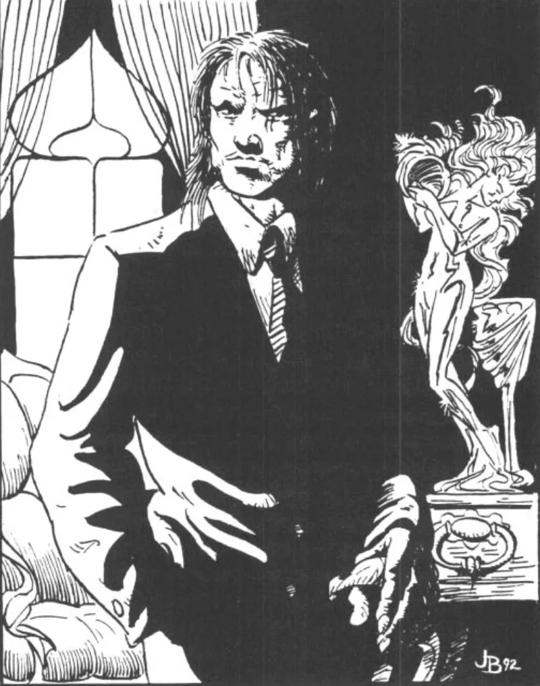

<dl>
<dt>Clan</dt><dd>Ventrue</dd>
<dt>Generation</dt><dd>7th generation</dd>
<dt>Role</dt><dd>Prince of Milwaukee</dd>
<dt>City</dt><dd>Milwaukee</dd>
</dl>

Terence Merik was born in 1645 to a landed family in Kent, England. An earl by birth, educated in the manner of Restoration-era gentry: classical languages, horsemanship, the administration of rural estates. He grew into the role expected of him. Managed tenant farmers. Collected rents. Attended court functions in London when protocol demanded it. A competent, unremarkable member of the English aristocracy during a period when competence and unremarkability were the highest virtues of his class.

Christmas 1683, a Countess whose name Merik has never shared Embraced him. The circumstances of the Embrace are unrecorded. What followed was a long, patient education in Ventrue politics conducted across the courts of late-Stuart and Georgian England. Merik learned to outlast rather than outfight. He cultivated the habits of command that would define his later centuries: the clipped sentence, the expectation of obedience, the refusal to explain himself twice.

By 1750, the mortals around his Kent holdings had begun to notice that their lord did not age. A minor peasant uprising provided the exit. Merik staged his death in the violence and crossed the Atlantic to rebuild in the New World.

The American Civil War introduced him to the woman who would become his wife. She was Gangrel, working as a nurse for Union soldiers. When northern troops requisitioned Merik's plantation as a field hospital, he recognized her immediately for what she was. He did not court her. He Blood Bound her and fled north when the war ended, dragging her away from the life she had built among the living. Whatever she had been before the Bond, she became his instrument after it.

Her value proved extraordinary. She carried friendships among the Lupines of the upper Midwest, relationships that predated Merik by centuries. In the 1920s, he weaponized those contacts to control liquor traffic around Milwaukee during Prohibition. Bootlegging built an organized crime apparatus. The crime apparatus built political influence. By 1930, Merik had accumulated enough leverage to force Prince Rickson into abdication. He took praxis without a shot fired.

The Lupine connections became his signature achievement. By maneuvering werewolf packs against each other through his wife's intermediaries, he kept the packs fighting themselves instead of Milwaukee's Kindred. On New Year's Eve, 1900, when a massive Lupine invasion struck the city, Merik personally led the counter-attack. He was nearly killed. The defense succeeded largely because of him. It cemented his reputation as a Prince who could protect his domain.

Then, a few weeks before the present nights, the architecture collapsed. Merik waited too long to feed. The Beast rose and he could not contain it. He killed a couple on a park bench. His wife found him over the bodies and tried to stop him. He killed her too. The woman he had Blood Bound during the Civil War, who had given him the Lupine contacts, the bootlegging empire, the Princedom itself. Dead by his hands in a public park.

The break was total. 422 murders followed. Merik now operates as two people: one half creates elaborate investigations to catch the killer, the other half commits the killings with increasing theatrical cruelty. He appointed "The Mask" to solve the case. He is the case. Humanity zero. The [Earl](/npcs/earl/) of Kent is gone. What remains is a Prince-shaped thing running on reflex and madness, issuing commands from a penthouse while the city he built bleeds out beneath him.
