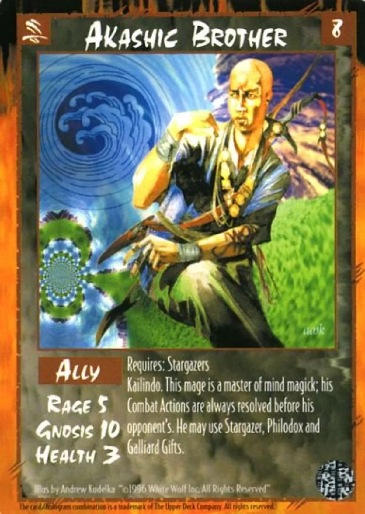

<dl>
<dt>Clan</dt><dd>Mage (Akashic Brotherhood — fallen)</dd>
<dt>Role</dt><dd>Nephandi mastermind</dd>
<dt>City</dt><dd>Chicago</dd>
</dl>

How old he actually is remains unclear. The Akashic Brotherhood does not acknowledge him. The Nephandi do not claim him. He predates the fall of the Himalayan War and may predate the formation of the Traditions. His mortal identity recycles every few decades. The current one — an elderly Cantonese immigrant — has been in use since approximately 1955.

The Wing Kong tong is his primary instrument on Earth. They run gambling, protection, heroin, and human trafficking through [Chinatown](/locations/chinatown/). The tong's lieutenants believe they serve a mortal crime lord. The old man in the back room who dispenses advice is just grandfather. They do not know that grandfather can unmake them with a thought.

His alliance with the unnamed Tremere vampire is the most dangerous intersection for Kindred. A Nephandi with a Tremere informant means Thaumaturgy intelligence flowing to something far worse than the Pyramid. If [Nicolai](/npcs/nicolai/) or any Chicago Tremere discovered this alliance, the response would be immediate and total.
