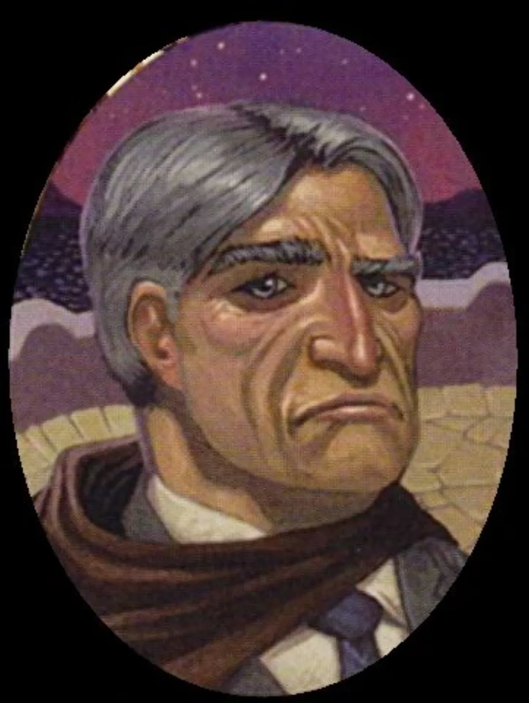

<dl>
<dt>Clan</dt><dd>Lasombra</dd>
<dt>Generation</dt><dd>7th generation</dd>
<dt>Role</dt><dd>Templar, Lost Angels co-leader</dd>
<dt>City</dt><dd>Montreal</dd>
</dl>

Tobias Smith was Embraced in Malta in the late 1880s and has been with the Sabbat ever since. A former member of several influential and respected packs, Smith fought bravely in the sect's civil war. He rose quickly through the ranks and became a templar to Cardinal Desmoines during World War I. His career was long and distinguished, and he went on to advise and protect Cardinal Desmoines in Mexico City. Smith himself might have been named cardinal if he hadn't been so distracted by the mortal [Carolina Valez](/npcs/carolina-valez/).

He watched her from afar for a month, and fell in love with the Mexican's intensity. Giving in to his desire, he kidnapped Carolina and forced her through the Creation Rites only to be fraught with guilt. He left the cemetery before she rose, leaving her to be discovered by other Sabbat. From that day forward, Smith looked after [Valez](/npcs/carolina-valez/) and used his influence to pave her road to success.

Though they do not see eye to eye on many subjects, Smith and [Valez](/npcs/carolina-valez/) respect and understand each other. Their combination as moderate and ultraconservative provides the Lost Angels with its greatest strength.

**Image:** Tobias Smith is austere. His square jaw and narrow eyes seem to be set in stone. His gray hair suggests age and wisdom. Smith dresses in gray or black conservative suits and always wears a cloak, even in summer. He uses Obtenebration to make himself more imposing.

**Secrets:** Smith knows of Valez's granddaughter and does what he can to protect his love's secret. Josefina shares her grandmother's beauty and, ironically, may tempt Tobias to Embrace her as well. Both the Shepherds and [Ezekiel](/npcs/ezekiel/) respect Tobias. [Ezekiel](/npcs/ezekiel/) sees him as a father figure and has asked him on numerous occasions to create a new coven with him. Smith has refused, not willing to part with Valez, but knows that if her secret ever gets out, it will spell her end as well as his. Tobias will eventually have to choose between the Sabbat and Valez.
