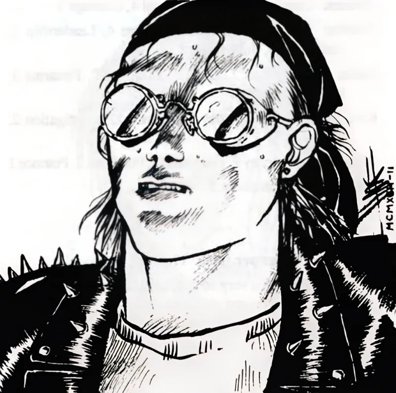

<dl>
<dt>Clan</dt><dd>Brujah</dd>
<dt>Generation</dt><dd>12th generation</dd>
<dt>Role</dt><dd>Union Leader</dd>
<dt>City</dt><dd>Milwaukee</dd>
</dl>

Turk was born around 1958 in Milwaukee, Wisconsin. He was on the streets by age nine -- 1967, the year Milwaukee burned. The city's open housing marches, led by [Father](/npcs/father-joaquin/) James Groppi and the NAACP Youth Council, drew white mobs that threw bottles and rocks at Black marchers crossing the 16th Street Viaduct into the South Side. The National Guard was called. A curfew was imposed. For a Black child already homeless, the distinction between civic order and civic collapse was academic. The streets were the streets.

Milwaukee in the late 1960s was one of the most segregated cities in America -- a condition enforced not by law but by redlining, restrictive covenants, and the concentrated placement of public housing in the Inner Core. The Black population was confined to a narrow band of neighborhoods north of downtown. Turk grew up in that confinement. He never had a stable home. What he had was the street's education: who to avoid, where to sleep, how to take a beating without breaking.

He worshipped the Black Panthers from a distance -- their Milwaukee chapter was small but visible, running breakfast programs and confronting police. The Panthers gave a homeless kid a framework: the system was the enemy, and organized resistance was the answer. But it was the Blackstone Rangers who changed his trajectory. The Rangers were Chicago's largest and most sophisticated street gang, founded on the South Side in the early 1960s by Jeff Fort and Eugene Hairston. By the late 1960s they had expanded operations into Milwaukee, running drugs and muscle across the state line. Turk watched them operate with the attention of a boy who had nothing and wanted structure.

In 1972, a group calling itself Zulu Nation appeared on Milwaukee's streets. The source material describes this as the moment Turk found his purpose. The real-world Universal Zulu Nation was founded by Afrika Bambaataa in the Bronx in 1973, rooted in hip-hop culture and gang transformation. The Milwaukee version in the source material is a street gang, not a cultural movement -- but the name carried the same charge: Black identity, collective power, refusal to submit. Turk joined. "For two years we ruled the streets."

Zulu Nation fell apart the way street organizations always fall apart: members got families, went to prison, died. The survivors were beaten by enemies the source material describes obliquely -- "It required those who weren't alive to defeat us." Vampires destroyed Zulu Nation. Turk lay on the ground afterward, crying, shaking with rage, and one of the victors found that amusing.

[Gengis](/npcs/gengis/) was a Chicago Anarch, Brujah, part of the city's volatile neonate underclass. He lifted Turk off the ground, wiped the tears from his face, traced a finger from cheek to neck, and bit. "There was nothing but sheer, undeniable ecstasy." Then [Gengis](/npcs/gengis/) left. No instruction. No clan. No explanation. Turk woke up dead and alone in 1975, a Caitiff with no sire, no lineage, and no knowledge of what he had become.

He built the Union from nothing -- a gang of abandoned childer and Caitiff, structured the only way Turk knew how: by controlling territory and demanding loyalty. He committed diablerie on a rival Anarch gang leader, dropping his effective generation to 12th. The Union became Milwaukee's second-largest Kindred gang, a counterweight to [Akawa](/npcs/akawa/)'s Blood Brothers.

What Turk does not know is that none of it is his. Sometime after the Embrace, Prince [Merik](/npcs/terence-merik/)'s Malkavian agent Esau began Dominating him -- layering Conditioning so deep that Turk experiences [Merik](/npcs/terence-merik/)'s directives as his own ideas. The Autocrat personality that built the Union is buried. What operates the Union now is a puppet whose strings are invisible even to itself. Gengis returned once, fleeing enemies in Chicago, and shared blood with Turk -- creating an accidental partial Bond. If Turk were destroyed, Gengis would feel it and come back. This is the one thread Merik cannot control.
