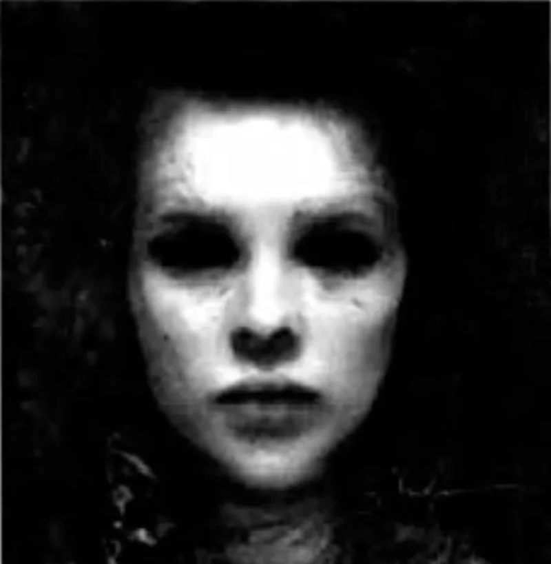

<dl>
<dt>Clan</dt><dd>Brujah</dd>
<dt>Generation</dt><dd>6th generation</dd>
<dt>Role</dt><dd>Brujah Elder</dd>
<dt>City</dt><dd>Chicago</dd>
</dl>

Real name: Patricia of Bollingbroke. Medieval England. A peasant woman whose husband was killed by a baron for poaching. The baron took her children as castle servants and sent men to capture her for sport. She fled into the revolt.

Led the anarch assault on Hardestadt Castle. Committed diablerie on the Ventrue elder Hardestadt — an act that delayed the founding of the Camarilla and electrified the growing anarch community. Her success became the spark that led to the Sabbat's formation. The proto-Sabbat begged her to lead them. She found them repugnant and fled to the New World. Changed her name to Tyler.

Controls O'Hare Airport. Every Kindred arriving by air passes through her territory. She regulates all vampire air traffic in and out of Chicago — arrivals, departures, cargo, refugees. O'Hare is her kingdom, her leverage, and her obsession. Aviation fulfilled a centuries-old dream of flight; she funded experimental aircraft before the Wright brothers flew.

Blood Bound to [Helena](/npcs/helena/). Served [Helena](/npcs/helena/) as an assassin in Cartagena, hunting powerful Cainites and consuming earlier-generation vitae. The craving for diablerie did not end with Hardestadt. Helena feeds that hunger, and the Bond ensures Tyler keeps feeding it in Helena's service.

Has a secret tie to the Sabbat through the Tzimisce elder Lambach Ruthven in New York. Arranged for a Sabbat pack's placement in Chicago as payment for Ruthven's warning about the Lupine attacks. The deal was pragmatic — Tyler wanted advance notice to survive the coming war. The cost was letting the enemy inside the gates.
