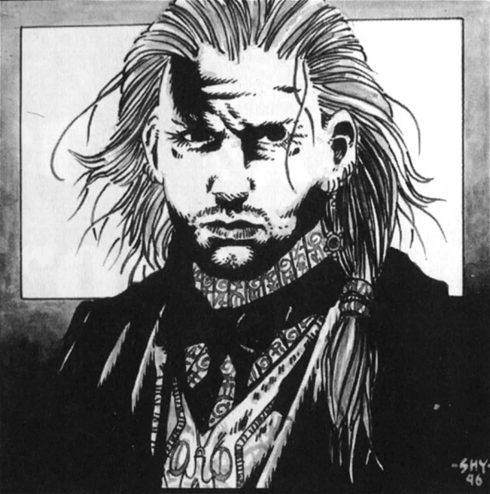

<dl>
<dt>Clan</dt><dd>Tremere</dd>
<dt>Generation</dt><dd>9th generation</dd>
<dt>Role</dt><dd>Camarilla spy, Tremere agent</dd>
<dt>City</dt><dd>Montreal</dd>
</dl>

In a city like Montreal there are plenty of shadows in which to hide, and Valois Sang makes use of them. On a mission for his sire, the Tremere Prince of Quebec City, Valois is in Montreal to gather as much information as he possibly can and to ascertain the Sabbat's weaknesses, if any.

Valois, a psychiatrist in life, quickly rose through the ranks of the Tremere hierarchy. His mission in Montreal is a test of his newfound status. Having arrived only a few months ago, he has established himself in a secluded mansion in Westmount that has a commanding view of the city. Valois is in contact with [Marie-Helene](/npcs/marie-helene-dutoit/), a member of the Lost Angels who has secret designs for Montreal. Valois is under orders to eliminate Marie-Helene if she poses a threat to the Tremere mission.

Aside from testing the Sabbat's strength, Valois is charged with discovering all he can about the mysterious presence of Metathiax. His research has been academic so far. After establishing a secret chantry, he will look for other Tremere, and possibly other Camarilla Kindred, to aid him in his task.

**Image:** Valois is rather attractive; his eyes are ice-cold and his blond hair is always tied in a ponytail. He wears simple, conservative suits.
