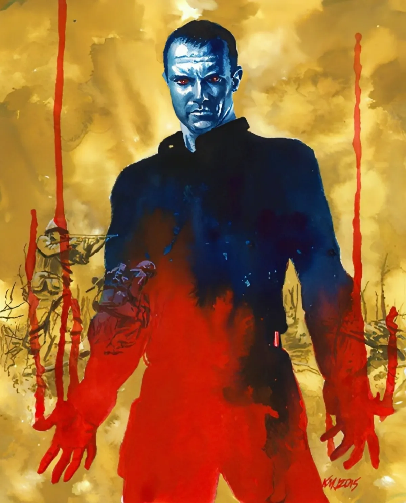

<dl>
<dt>Clan</dt><dd>Tremere</dd>
<dt>Generation</dt><dd>9th generation</dd>
<dt>Role</dt><dd>Tremere enforcer and Vienna's watchdog in Milwaukee</dd>
<dt>City</dt><dd>Milwaukee</dd>
</dl>

Embraced in 1950. Victor was the world's best assassin, working unofficially for the CIA for upwards of fifty grand a head. Sent to kill a Greek noble — Duke Traska — who was stirring up anti-American sentiment. Hesitated over the bed with the hypodermic, and the Duke moved faster than any old man should. After a wrestling match, Victor tried to flee through the window. Their eyes met. The Duke used Dominate, and that was the end of Victor's mortal career.

The CIA assumed he was dead or turned. The Tremere trained him in Vienna. Now he kills when they tell him to kill and watches whom they tell him to watch. Currently watching the other Tremere in Milwaukee. Vienna fears whatever they study at Marquette could be too powerful — possibly capable of negating a Blood Bond. Victor is here to ensure the death of any Kindred who tries to control such power, or perhaps to take it for himself.

Strong face with a deep scar across his right cheek. Wears baggy black clothing resembling a karate gi. Always gives the impression he is about to kill somebody. Never smiles. Moves with the grace and ease of a tiger.

**Apparent Age:** 35
**Embrace:** 1950
