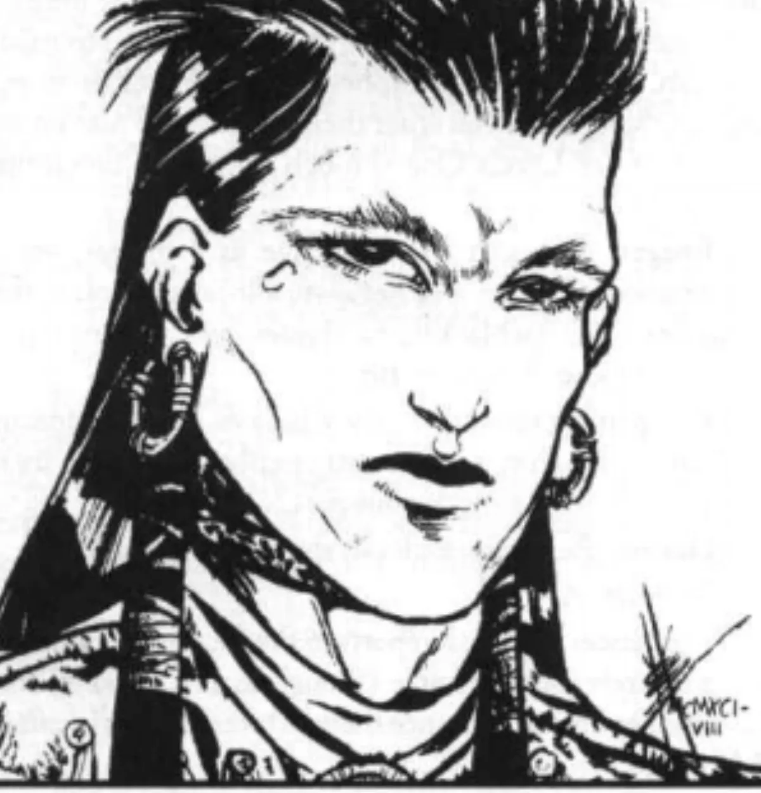

<dl>
<dt>Clan</dt><dd>Unknown (Gangrel lineage implied)</dd>
<dt>Generation</dt><dd>6th generation</dd>
<dt>Role</dt><dd>Amerind Cainite / [Menele](/npcs/menele/)'s former guardian</dd>
<dt>City</dt><dd>Chicago</dd>
</dl>

Yaryan still remembers the day he met the Pale Wolf just as vividly as if it had been yesterday. Then Yaryan had been known as Shining Deer for his great beauty, and he hoped to someday become medicine man for his people. The Pale Wolf changed that. He offered Shining Deer's teacher an eternity to live and the teacher accepted. His teacher in turn passed the gift on to Shining Deer.

While Shining Deer did not like the blood thirst forced upon him, he came to accept his new form and soon a small group of Cainites had been made in the wilds of North America. For generations they lived on in peace. Then came the white men.

Shining Deer's tribe had heard about these ravaging creatures who seemed to take special pride in driving the red men from their ancestral lands. When they tried to do this to his tribe, they found themselves checked. Not only did the Amerinds have a cult of Vampires to help them, but Chief Black Hawk had become their leader and proved himself a mighty commander. They forced the bluecoats to abandon their fort once, but then the white men returned in mass, and with immortal allies of their own.

Soon the tide turned. Unable to defeat the overwhelming technology of their enemies with bravery alone, they found themselves being defeated again and again. During one especially ferocious battle Shining Deer saw the Pale Wolf lose all control. In a fury he attacked a woman who seemed to be leading the enemy — and soon both were struck down. Shining Deer and the other surviving Amerind Vampires attacked and managed to rescue their ally, but not before he had been grievously wounded.

Defeated and without hope, the tribe left the area, but left Shining Deer and the Pale Wolf behind to find a place of safety where the Pale Wolf could recover. For more than a century Shining Deer stayed with the Pale Wolf, protecting him from all harm. He stayed apart from the city which grew up around him and only ventured forth for the Vitae he needed.

Then visitors came seeking the Pale Wolf. They wanted to kill him — who they called [Menele](/npcs/menele/) — to become even more powerful. Horrified, Shining Deer drove the newcomers from his Haven, but not before they told him how [Menele](/npcs/menele/) and his ancient Jyhad had been responsible for the destruction of his tribe.

Shining Deer moved [Menele](/npcs/menele/) to a new hiding place and began to meditate. The more he thought about it, the more he decided the visitors had been correct. Then he found that something prevented him from acting on this new knowledge — the Vampire he had guarded for so long held a bond over him. Extremely bitter, he decided only a complete break with what he had been could lead to freedom.

With the help of an ancient purification rite and the Yaryan root, he managed to break the bonds which held him to his old master. Then he fled into the city. He has maintained a link to Menele through an ancient trapper who serves as his retainer. The trapper occasionally checks on Menele, and knows how to contact Yaryan should anything be wrong. Despite his new knowledge, Yaryan would still return to the aid of his ancestor if he knew something had gone wrong.
