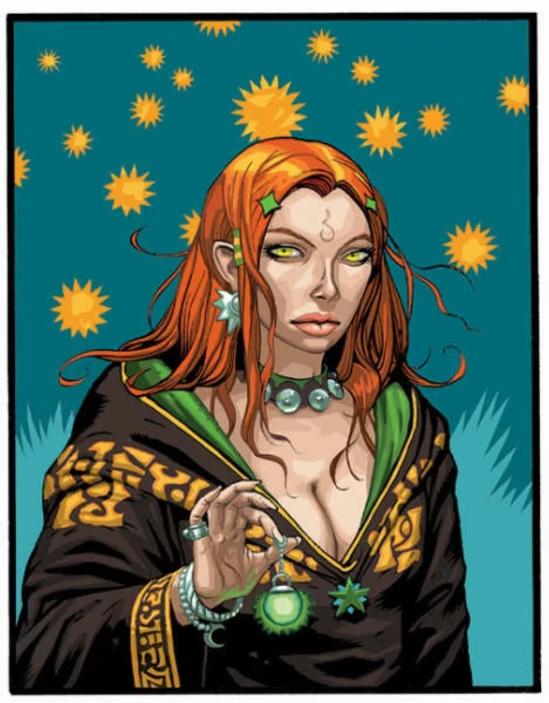

<dl>
<dt>Clan</dt><dd>Tremere antitribu</dd>
<dt>Generation</dt><dd>[OCR unclear] generation</dd>
<dt>Role</dt><dd>25:17 thaumaturgist, seeker of ancient Setite lore</dd>
<dt>City</dt><dd>Montreal</dd>
</dl>

Yasmin, an archaeology student, was involved in a dig in eastern Lebanon when her party came across an ancient tomb. Unbeknownst to her, Marnius, the British Tremere antitribu and backer of the project, was searching for the lair of Sukhmet, an ancient Follower of Set. The antitribu used the archaeologists to uncover the tomb and chose to reward them with death. As Marnius and his packmates killed the mortals, Sukhmet rose from torpor and attacked the Sabbat war party. He would have destroyed them all had Yasmin, in a panic, not staked the ancient with a shovel. Marnius seized that opportunity to leap on Sukhmet and drained him until only ashes remained. Marnius Embraced Yasmin right there, sealing her and the surviving archaeologists in the tomb. The following night, she arose with Marnius' and Sukhmet's blood running through her veins. In a frenzy, she devoured her coworkers and dug her way to the surface where Marnius awaited.

In the years that followed, Yasmin traveled with Marnius, learning of and developing her Thaumaturgical abilities. She eventually left Marnius, joined the Black Hand and quickly rose through the ranks given her Thaumaturgical expertise. It was during this period that Yasmin met [Ezekiel](/npcs/ezekiel/). At first she disliked him, but she soon grew to understand the Serpent and agreed to join his pack. She did so primarily because of her interest in discovering who Sukhmet really was. Yasmin hopes that after Ezekiel becomes Archbishop of Montreal she will be allowed to join the Librarians and finally learn the history of the mysterious Methuselah.

**Image:** Yasmin plays up her mystic image. She wears dark-hooded robes adorned with symbols and markings. She possesses a mysterious and exotic beauty; her naturally red hair contrasts with her almost yellow eyes, which she never blinks.

**Secrets:** Yasmin's dreams have forced her to witness things that would make most vampires, even the Sabbat, cringe. She knows that Sukhmet met his end, yet in the back of her mind has doubts. Many of the visions she has end with Sukhmet rising upon Gehenna and devouring her. This only strengthens her desire to discover as much as she can about the Setite so that she can determine if her nightmares represent her unconscious fears or a dark reality.
