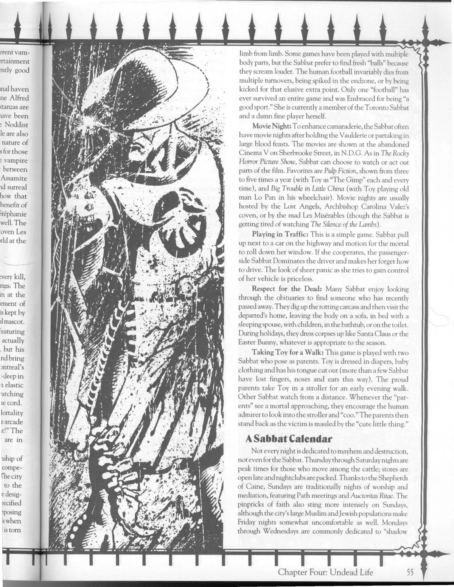

<dl>
<dt>Clan</dt><dd>Tzimisce</dd>
<dt>Generation</dt><dd>7th generation</dd>
<dt>Role</dt><dd>Circus-master, the Angel of Cruelty</dd>
<dt>City</dt><dd>Montreal</dd>
</dl>

Maciej Zarnovich was born in Poland and was interested in medicine from an early age, especially in its potential to overcome death. In school, he quickly discovered how crude contemporary medicine was. He started conducting his own experiments in order to prove his theories, and he was eventually jailed for the murder of one of his patients. When he was released, Zarnovich set up shop as a street physician, which is how he met his sire. The Embrace opened Zarnovich's eyes to the world and granted him a new understanding of death.

Zarnovich established his circus and traveling show, allowing him to conduct experiments and weaken the Masquerade. Being an outsider all his life, he attracted other outcasts to his side. Zarnovich's Circus was founded in 1826 and was one of the Sabbat's most potent weapons against the Masquerade in Europe during the 19th century. The circus traveled across the continent, setting up on the outskirts of cities and towns while [Bratovitch](/npcs/bratovitch-ghoul/) children handed out flyers. Audiences were treated to a show they would never forget, as Zarnovich and his menagerie tormented and ultimately shattered their sanity.

In 1856, Adginis, a Camarilla Justicar who had been tracking the circus for some time, ambushed it and destroyed every member save Zarnovich. The circus-master fled to Montreal where he turned his attention to conducting experiments for 60 years -- until he decided to reform the circus in 1933.

Zarnovich has been conducting experiments on children and the elderly for the last 30 years, grafting limbs and other objects onto his victims' bodies, even creating Siamese twins by sewing children and animals together. Zarnovich uses Vicissitude to mask stitches and makes these "creations" his newest attractions.

**Image:** Zarnovich has had his limbs stretched and altered by Vicissitude, giving him a tall, gaunt -- not to mention disturbing -- appearance. His face is extremely hollow and has a well-defined bone structure over which his flesh stretches. He always wears black to hide the bloodstains on his clothes, but the smell of formaldehyde about him is unmistakable.

**Secrets:** Surprisingly, Zarnovich knows more about Montreal than most think, and he often sends his "creations" out to spy. Zarnovich's agents learned of the growth in [Caroline Bishop](/npcs/caroline-bishop/). Zarnovich is unsure whether to approach her to offer his help or simply to kidnap her. Whatever he decides, he knows that [Stephanie L'Heureux](/npcs/stephanie-lheureux/), his progeny and leader of the Wretched, will be jealous, so he must keep his plans secret from her.
