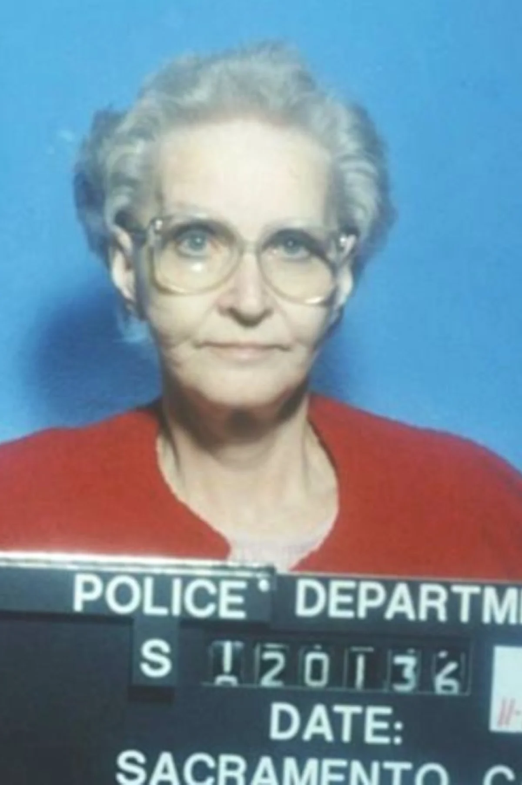

<dl>
<dt>Full Name</dt><dd>Puente (born Lucia Elena Puente)</dd>
<dt>Clan</dt><dd>Tzimisce</dd>
<dt>Generation</dt><dd>10th</dd>
<dt>Sire</dt><dd>The Rose (9th gen Tzimisce, Bishop of Montreal)</dd>
<dt>Haven</dt><dd>Chinatown, Montreal (sovereign domain)</dd>
<dt>Nature / Demeanor</dt><dd>Autocrat / Caretaker</dd>
<dt>Role</dt><dd>Territorial sovereign / domain keeper, Les Fossoyeurs</dd>
</dl>

## Who Is She

Puente is not cold. She is precise. There is a difference that most people cannot perceive and that she has stopped trying to explain. She holds Chinatown the way a voivode holds domain -- as a sovereign right, not a delegated privilege. The pack operates within it by her permission. She knows every door, every alley, every basement entrance. She has modified the nerve clusters in her feet to detect pressure changes in the ground. When someone enters Chinatown without her knowledge, she feels it.

---

## Before

Lucia Puente was born in 1963 in Tegucigalpa, Honduras. She was a biology student at UNAH -- competent, uninspired, heading toward nursing or teaching. In November 1983, Battalion 316 took her older sister Marisol. Marisol was a schoolteacher who had attended one union meeting. She did not come home. The family was told nothing for eight months.

Lucia did not break. She went still. The Catholic, orderly world had been revealed as a theater set -- flat, painted, held together with screws anyone could see. What remained was biology. Cells divided. Organisms adapted. The flesh did what it did regardless of the story being told about it. She applied to McGill University and left Honduras with a suitcase, her mother's rosary, and a photograph of Marisol she kept in her wallet and did not look at.

---

## The Embrace

The Rose found her in 1988. She wanted a Tzimisce childe who would not bend -- a woman raised in restraint who would have the furthest distance to travel toward transcendence. She watched Lucia dissect a cadaver with the focused care of someone trying to understand, through dead tissue, what living tissue had been. She recognized the impulse that had drawn the Tzimisce to Vicissitude for millennia.

The Embrace was not gentle. When it was over and Lucia's heart had stopped and the room smelled like copper and old roses, she asked one question: "Do I still have hands?" The Rose laughed. It was the first time the Widows had heard The Rose laugh in decades.

---

## The Unlife

Vicissitude changed everything. The first time she reshaped her own hand -- extending the fingers by half an inch, feeling the bone flow like warm wax beneath the skin -- the stillness broke. Not into chaos. Into purpose. The flesh was not fixed. The flesh was a medium that could be written. She adopted the Path of Metamorphosis within six months.

She left the Widows in 1990. She claimed Chinatown because nobody else wanted it. She learned Cantonese from the merchants. She made herself useful to the community's power structure without revealing what she was. When Calvi assembled the Fossoyeurs, Puente accepted on a condition: Chinatown was hers. Calvi agreed. The tension between ductus authority and domain sovereignty became the pack's productive friction.

And beneath everything, the Tzimisce blood carries a knowledge that the Path does not name: in 1022, mortal magi captured Tzimisce elders and stole the secret of vampirism to make themselves Clan Tremere. A thousand years later, every Tremere chantry is a monument to the original crime. Puente's Vicissitude was never stolen. It flows from the blood as naturally as sight flows from eyes. When she watches a chantry burn in Quebec City, the flesh will recognize what it sees.

---

## What She Wants

**The Azhi Dahaka.** The theoretical endpoint of Metamorphosis -- the transcendent state beyond vampire, beyond mortal, beyond category. She does not expect to reach it. The research itself is the point. The process is the product. The flesh is the laboratory.

## What She Fears

**Stasis.** The arrested state. The failure to change. A Tzimisce who stops transforming is a Tzimisce who has accepted the draft as the final text.

**The chantry on Astor Street.** Not fear exactly. Gravity. She watched the Quebec City chantry's wards die. She memorized the architecture. She knows what Nicolai's fortress looks like from the inside. The flesh pulls her toward that door the way water runs downhill.

---

## Voice

> "Do I still have hands? Good. Then the rest is negotiable."

> "Chinatown is mine. The pack operates within it. This distinction matters."

> "The flesh remembers what was taken. I do not need to."
