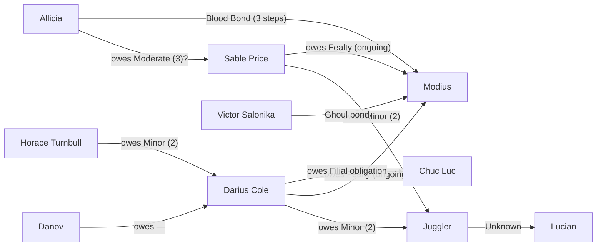
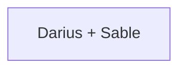

*Generated from `session-state.md` and `Boon Ledger.md`. This is the drift-resistant operational map; the handcrafted public map remains archival/curated.*

## Obligations

## Disposition Heat

## Chicago Standing

- Court 2/5 (Recognized): Critias +2 (faculty club invitation). Brennon +1 (office line). Annabelle +3 (property warning). Wednesday session = next formal step.
- Society 2/5 (Established): Succubus Club explored including Labyrinth. Brennon met. Falcon boon. Sir Henry +3. Toreador social infrastructure mapped.
- Underworld 0/5 (Unknown): No standing yet with Capone, Chuc Luc's Chicago operators, or the city's criminal brokers
- Street 1/5 (Emerging): Gengis +1 (Brewery confirmed Thursdays). Maldavis +1 (shared intel, task accepted). Anarch channel open.
