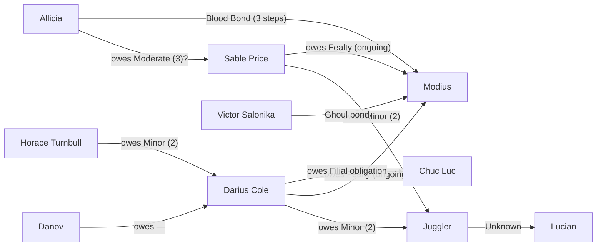
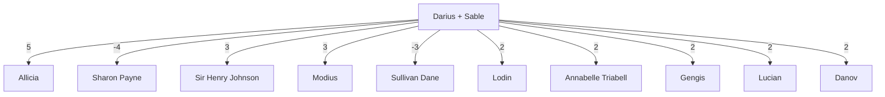

*Generated from `session-state.md` and `Boon Ledger.md`. This is the drift-resistant operational map; the handcrafted public map remains archival/curated.*

## Obligations

## Disposition Heat

## Chicago Standing

- Court 1/5 (Known): Arriving as Modius's emissaries with letters. Status comes from purpose, not trust
- Society 1/5 (Known): Sir Henry referral gives them one soft entry point into Toreador / Succubus space
- Underworld 0/5 (Unknown): No standing yet with Capone, Chuc Luc's Chicago operators, or the city's criminal brokers
- Street 0/5 (Unknown): No established footing yet with Anarchs, Brewery traffic, or district-level crews
