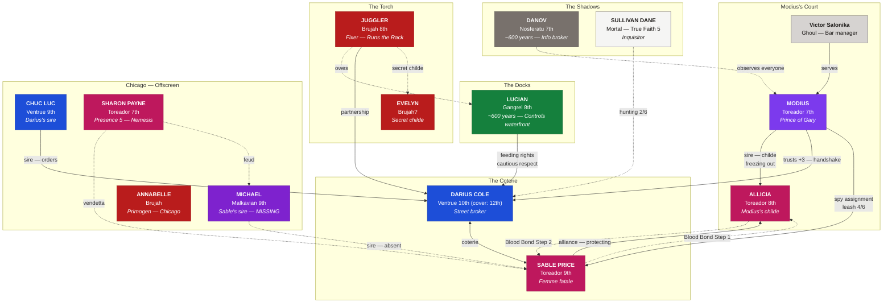
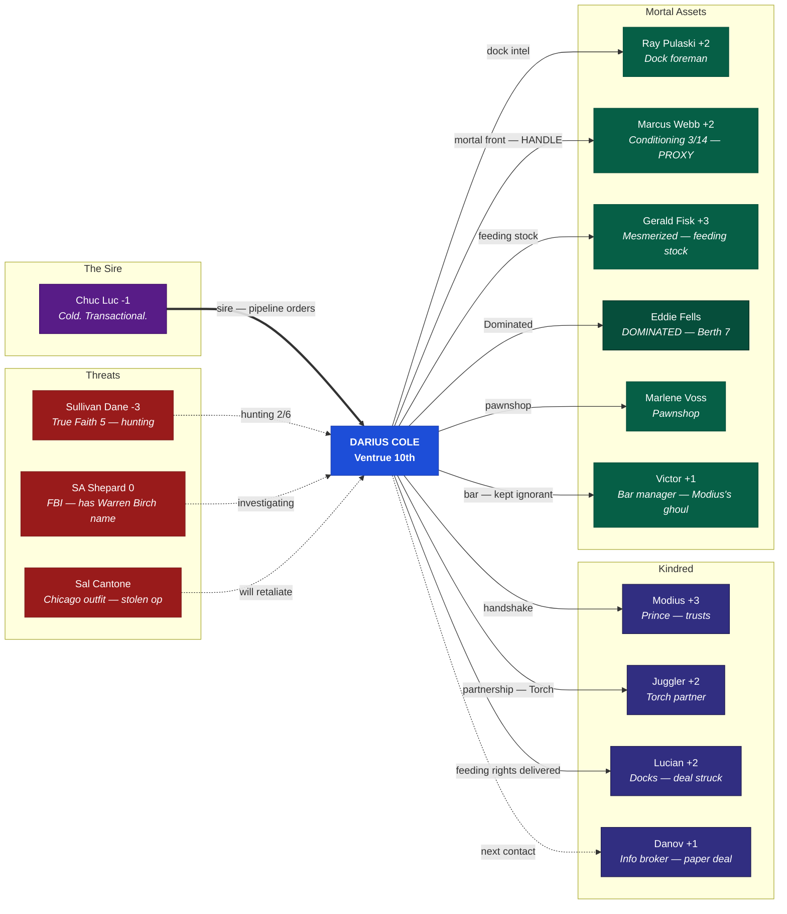
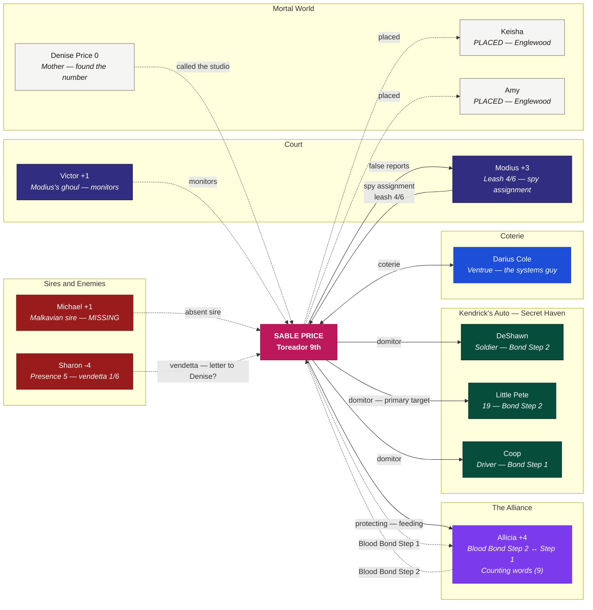

> **Historical — Act I, July 21, 1990.** For current Chicago relationships (Act II: Ashes and Blood, 1991+), see [Live Relationships](/relationships-live/).

*Solid lines = active relationships. Dashed lines = hidden, latent, or threatened.*

---

## Gary Kindred Power Structure

The political map of Gary, Indiana. Eight Kindred, twelve blocks, and every one of them watching the others.

**Key:**
Ventrue |
Toreador |
Brujah |
Gangrel |
Nosferatu |
Malkavian

---

## Darius Cole — Personal Network

The Architect's machine. Everyone has a function. Everyone has a price.

**Clock Pressure:** Cover Story 3/6 | Torch Heat 5/6 | Dock Exposure 3/6 | Dane 2/6

---

## Sable Price — Personal Network

The Survivor's web. Everyone sees something different. None of them see her.

**Clock Pressure:** Modius Leash 4/6 | Sharon Vendetta 1/6 | West Side Heat 1/6 | Humanity 5

---

*These maps reflect the state of play as of July 21, 1990 — midway through Act I. By Baptism by Fire (NYE 1990), every line on these charts will have been tested, broken, or redrawn.*
