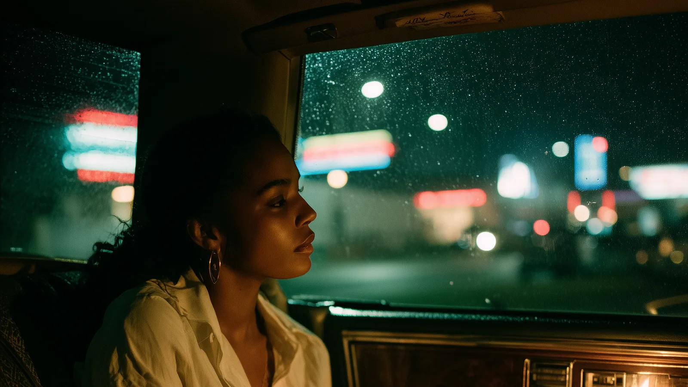

<dl>
<dt>Full Name</dt><dd>Sable Ann Price</dd>
<dt>Clan</dt><dd>Toreador</dd>
<dt>Generation</dt><dd>9th</dd>
<dt>Sire</dt><dd>[Michael](/npcs/michael/) Payne (absent)</dd>
<dt>Haven</dt><dd>Kendrick's Auto, Gary</dd>
<dt>Nature / Demeanor</dt><dd>Survivor / Bon Vivant</dd>
<dt>Disciplines</dt><dd>Presence, Auspex, Celerity</dd>
</dl>

## Who Is She

Sable Ann Price is a twenty-one-year-old Black woman from the Robert Taylor Homes who has been dead for fourteen months and beautiful her entire life and has never once been seen.

In mortal terms she was an exotic dancer, a survivor, a girl from the projects who learned to convert her face into currency at an age when other girls were learning algebra. In Kindred terms she is a 9th-generation Toreador, the abandoned childe of a distracted painter locked in a sixty-year war with his ex-wife, Embraced in an act of romantic rage and left to figure out immortality alone.

She can walk into any room and make every person in it want her. She can bend a human being's emotions until they become a willing servant who believes their devotion is their own idea. She can sense arousal, fear, and deception through the physical markers that the mortal body cannot hide.

She cannot make anyone love her. She can only make them want to. The distance between those two things is the width of her entire existence.

---

## Before

Born October 2, 1968, in the Robert Taylor Homes, Chicago. The projects. Twenty-eight sixteen-story towers stretching along State Street like a concrete spine, 27,000 people stacked in 4,400 units, 95% Black, median income below the poverty line. Her mother, Denise Price, was a hairdresser who worked out of the kitchen and named her daughter Sable because sable was the most expensive fur she'd ever touched, once, in a department store on Michigan Avenue, before the security guard told her to move along.

She was beautiful early. That was the problem. At twelve she had the body of a seventeen-year-old and the face of something a painter would have put on a church ceiling if painters still painted church ceilings. By fourteen she understood exactly what the attention was and had two options: be afraid of it or use it. She chose to use it. Not out of courage. Out of arithmetic. Beauty was the only capital she had, and the South Side was not a place that let you sit on capital without investing it.

She started dancing at sixteen. Go-go clubs, house parties, the under-21 nights where the DJs played house music and the lights were low enough that nobody checked IDs. At seventeen she moved to stripping — a club called The Oasis on 75th Street. Three hundred dollars on a Friday night, more if she worked the VIP. She gave half to Denise, who took it without asking where it came from, which was its own kind of love.

The kind of girl who smiled at everyone and trusted no one. Who could make a man feel like the only person in the world and forget him before he reached the parking lot. Who read desire the way a mechanic reads an engine — by the sound, by the vibration, by the heat. She wanted something she couldn't name. The closest she ever came to naming it was a night on the fire escape at four in the morning with a roll of twenties in her bra and the city spread out below her, and she thought: *I want someone to see me. Not this. Me.*

Nobody ever did.

---

## The Embrace

[Michael](/npcs/michael/) Payne was painting again. That was how it always started with him — a burst of creative obsession that lasted weeks or months and ended when [Sharon](/npcs/sharon-payne/) destroyed whatever he'd made.

He found Sable at The Oasis on a Tuesday in November 1988. She wasn't the best dancer on the stage. She was the one you couldn't stop watching. [Michael](/npcs/michael/) sketched her for three hours. He offered her money to sit for him. Not sex. Just sit. She said yes because the money was good and because he didn't look at her the way Big Six looked at her. He looked at her the way a man looks at a painting he wants to buy. Which was, she would later understand, exactly the same thing, just more expensive.

Three weeks of painting sessions in his haven in Roselle — oil paints and turpentine and classical music, a world so different from the Robert Taylor Homes that Sable felt like she'd stepped through a screen into a movie. He didn't touch her. He talked about art, about beauty, about the way certain people had a quality that transcended their circumstances. She didn't know what he was. She knew he wasn't normal. He never ate. He was cold to the touch. His house had no mirrors.

Then [Sharon Payne](/npcs/sharon-payne/) came to the house. [Michael](/npcs/michael/)'s ex-wife. 7th generation. The open relationship. The Jazz Age dynamic that had survived sixty years of undeath because it was built on mutual destruction. For three weeks in December 1988, Sable was the center of a sexual triangle with two beings she didn't understand. Both of them feeding her vitae. Her mortal body flooding with something that made cocaine feel like aspirin.

She didn't know what she was drinking. She knew that she'd never felt this alive, this desired, this *seen*, and that the feeling was worth anything it cost.

It cost everything.

[Sharon](/npcs/sharon-payne/) realized [Michael](/npcs/michael/) was falling. The early sketches were studies. The December paintings were love letters. [Sharon](/npcs/sharon-payne/) destroyed the paintings — all of them, knife through canvas, turpentine on the oils. Then she left. [Michael](/npcs/michael/) Embraced Sable that same night. Not gently. In rage, in grief, in the specific Toreador madness that mistakes possession for preservation. He drained her in the studio surrounded by the ruined canvases and told her she was beautiful, she was art, she was his, and when she woke up three nights later she was twenty-one years old and she would be twenty-one years old forever and the woman who had painted her nails that morning in a kitchen on State Street would never see her daughter again.

[Michael](/npcs/michael/) Payne was a bad sire the way a distracted parent is a bad parent — not cruel, just absent. Within a week he was back at war with [Sharon](/npcs/sharon-payne/). Sable was left in the Roselle house with a hunger she didn't understand and a set of powers nobody had explained.

She drove to Gary in the fall of 1989. She went because it was the place where nobody looked, where beauty washed up when Chicago spat it out, where a Toreador neonate with no education could disappear into the ruins of a city that had already disappeared.

---

## What She Wants

To be seen. Not the body, not the face, not the thing that men project onto her when the Presence hits. Her. Whatever that is. She's not sure anymore. The Embrace froze her at twenty-one and she's starting to suspect that twenty-one wasn't old enough to know who she was, which means she might spend eternity looking for something that was never there to find.

## What She Fears

**[Sharon Payne](/npcs/sharon-payne/).** The ex-wife. The woman who shared Sable like a bottle of wine and then tried to smash her when Michael fell in love. [Sharon](/npcs/sharon-payne/) is out there, in Chicago, and she has not forgotten.

**Becoming [Allicia](/npcs/allicia/).** The silent Toreador at the piano. The beautiful woman who stopped speaking fifty years ago because there was nothing left to say. Sable looks at [Allicia](/npcs/allicia/) and sees the future: a weapon someone else aims, a body someone else owns, beauty reduced to function.

**Big Six.** He's still alive. He's still in Chicago. And the supernatural compulsion she thought the Embrace would free her from — the gravity of a man who decided she was his — turns out to be a mortal rehearsal for the Blood Bond. The cage was always the same shape. The bars just changed material.

---

## Voice

> *At [The Torch](/locations/the-torch/), when a Brujah neonate tries to buy her a drink:*
> "That's sweet. You're sweet. But I don't drink... what you're offering."

> *When [Modius](/npcs/modius/) compliments her at Elysium:*
> "Your Grace is too kind. I'm just trying to keep up with all this beauty. You've built something extraordinary here."

> *Alone, in the Buick, parked outside her haven:*
> Nothing. She sits in the dark and listens to the engine tick and doesn't think about her mother's hands.

> *When someone asks where she came from:*
> "Chicago. Before that, nowhere you'd want to visit. Before that, I don't remember."
